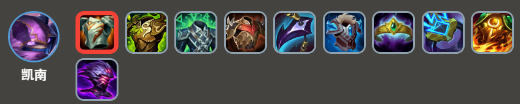
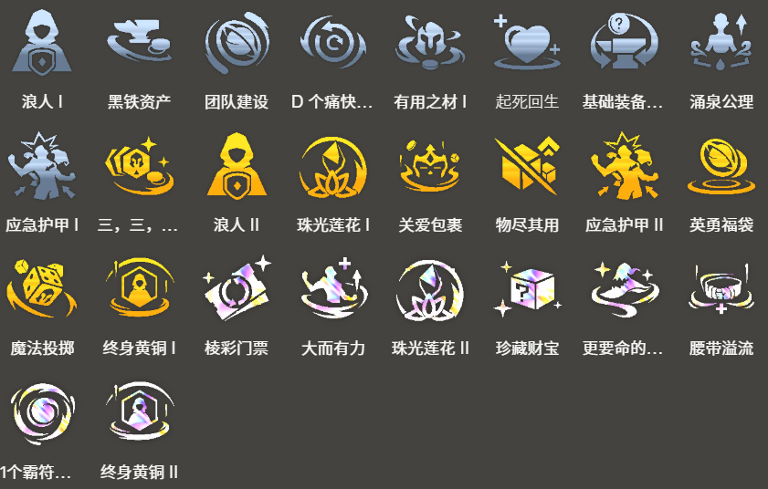

<!-- tags: 冷门阵容 -->
<!-- cover: dataTFT (22).png-->
<!-- backup: ahri-kenen -->

# 阿狸 凯南

## 📖 概要

3费核心的快速D牌阵容。

类似阵容有"以绪塔尔 巴德"，但主C和坦克费用不一样，因此可以根据切换切换。

基本上适合***巴德***同行太多，或者2-3阶段后才开始准备快速D牌阵容的情况。

由于***可酷伯与悠米***的解锁条件比较苛刻，特别推荐以**约德尔人**过渡时。

## 🎯 前置条件

以**约德尔人**过渡，制作法爆、纳什之牙等魔法系装备时

1节点获得***阿狸***时，以**艾欧尼亚**过渡时。

## 😀 最终阵容
.png>)

## 🔄 以绪塔尔回收

与"以绪塔尔 巴德"阵容不同，这套阵容费用非常高，希望瞄准"以绪" 的80、200层的奖励中包含的小型英雄复制器。

如果前期就出了***以绪塔尔***3，可以往更高层回收。

如果获得了岩宝，就加入到8级盘面中。

## 🎒 装备优先级

**阿狸**

**凯南**

优先制作***阿狸***的装备，以及解锁***斯卡纳***所需的石像鬼石板甲。

（法爆+纳什之牙）和蓝霸符、朔极之矛任意一个的回蓝装备是必需的。

希望给***米利欧***装备虚空之杖、莫雷洛秘典等辅助***阿狸***输出的装备。

如果材料制作困难，可以用日炎斗篷、离子火花代替。

## 🎯 强化符文

## 🔓 解锁条件

**凯南**
战斗中配置：战斗中总共8星级的"艾欧尼亚"、"约德尔人"、"护卫"

除了**艾欧尼亚**和**约德尔人**外进行的情况下，需要注意有意识地持有可用于解锁嘉文四世、慎等英雄的单位。

**可酷伯与悠米**
7级以上+战斗中配置：总共6星级的"约德尔人"、"斗士"、"法师"

和***凯南***同样，除了**约德尔人**外过渡 其他情况要保留可用于解锁的单位。

**斯卡纳**
7级以上+战斗中配置：装备"石像鬼石板甲"的坦克以外的1个单位

来源: tftips