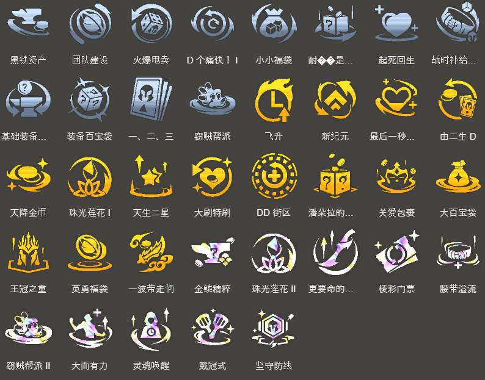

<!-- tags: 新手 -->
<!-- cover: image-14.png -->
<!-- backup: aphelios-3-star-ixtal-bard -->

# 厄斐琉斯 妮寇   由二生D 

## 🎯 阵容概要

**以绪塔尔巴德**的派生阵容，追求3星**厄斐琉斯**。

**优势**：
- **厄斐琉斯**前期强力，容易连胜过渡
- 稳定前四，不需要复杂的阵容转型
- 适合新手

**劣势**：
- 后期上限较低
- D牌时难以配合**以绪塔尔**羁绊
- 难以登顶

**8级后配置**：加入**塔里克**、**斯卡纳**、**斯维因**、**希瓦娜**、**费德提克**等强力单位。

**赵信**不追3星且**神盾使**羁绊不重要，可替换成其他单位。有余裕时加入**奥恩**。

## ⭐ 最终阵容
.png>)

## 🚀 前置条件

**必要条件**：
- 2-1前拿到**厄斐琉斯**
- 抽到强力D牌强化符文（如"由二生D"等）

**备选路线**：
- 如果有**巴德**的法术装备或早期出**以绪塔尔**羁绊，推荐转向"以绪塔尔巴德"
- 本阵容适合用**厄斐琉斯**连胜推进的局

## 📊 D牌流程

**2-1**：不升级，待机

**2-3**：
- 自动升4级
- D4次牌解除**巴德**羁绊
- 利用这波D牌打连胜

**3-2**：
- 升6级
- D牌找2星**厄斐琉斯** + 2星**妮蔻**

**3-2后**：
- 重新攒利息
- <u>保持50金慢D，追3星厄斐琉斯、妮蔻、巴德</u>

**3星完成后**：
- 升级
- 加入**奈德丽**、**塔里克**等强力单位完成阵容

## 🎒 装备优先级

### 厄斐琉斯（优先级最高）

**装备策略**：前期连胜优先，能做什么做什么，**海妖之怒**相性最佳。

### 巴德

**装备分配**：**无用大棒**、**女神之泪**等法术散件给**巴德**。

### 妮蔻

**装备分配**：**锁子甲**、**负极斗篷**、**巨人腰带**等防具散件给**妮蔻**。

## 🔓 羁绊解除条件

### 巴德羁绊解除
**条件**：2阶段选秀前D4次牌

### 奈德丽羁绊解除
**条件**：上场2个2星**妮蔻**

## 🎯 强化符文优先级

来源: tftips
