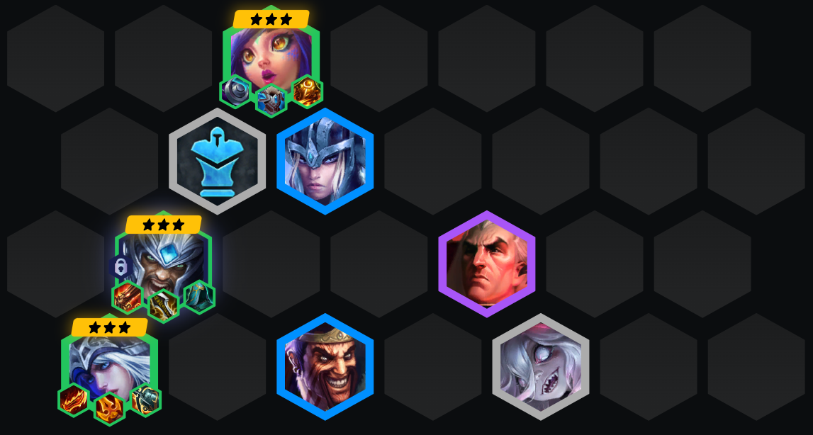
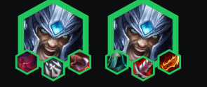
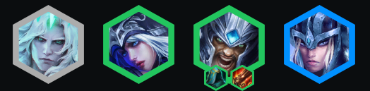
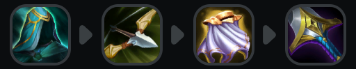

<!-- tags: 新手,神器装备,二费阵容 -->
<!-- cover: image-5.png -->
<!-- backup: ashe-tryndamere-ixtal -->

# 火炮 蛮王

## 🎯 提示

最佳配置搭配**神器装备**。

**以绪塔尔**羁绊容易融入阵容，6级加入**奇亚娜**即可，可以考虑做任务获取额外资源。

如果玩**由二生D**强化符文，<u>在2-3用免费D牌解锁巴德</u>。

如果**泰达米尔**的数量不多，**艾希**是可靠的主C备选。

## ⭐ 最终阵容

## 📊 二阶段

<u>尽快解锁泰达米尔</u>。

理想情况打连胜，但如果是连败也要通过站位换人头叠层数。

## 📊 三阶段

升到6级并D出2星**艾希**、2星**泰达米尔**、**妮蔻** + **瑟庄妮**。

临时放入任何**迅击战士**单位，直到找到**诺克萨斯**或**以绪塔尔**成员。

## 📊 四阶段

完成3星后升级找**斯维因**。

你很可能会在8级D到游戏结束，所以找优质坦克（**塔里克**、**斯卡纳**）、5费单位（**千珏**、**亚托克斯**）或带装3星**德莱文**。

## 🔄 替代装备

## 🎯 强化符文

## ⭐ 强化符文优先级
装备 > 经济 > 战力

## 🚀 前期构成

## 🎒 装备优先级

## 💪 灵活单位

来源: TFT Academy
