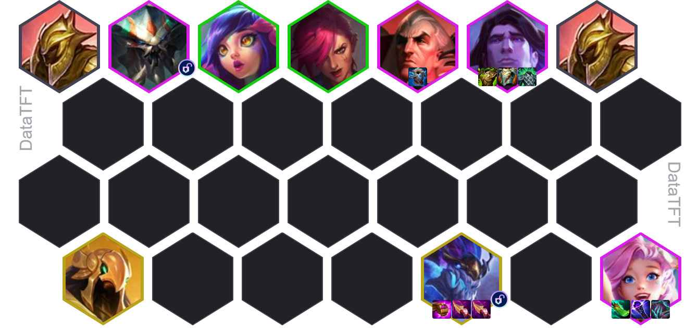
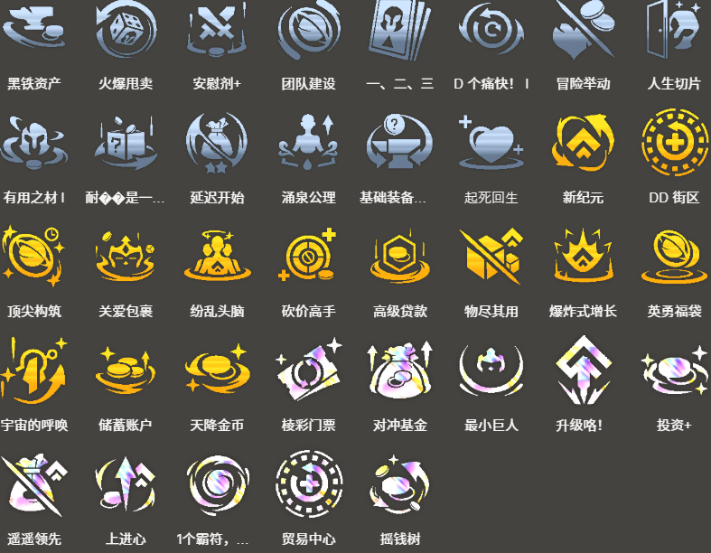

<!-- tags: 高费核心,巨后期阵容 -->
<!-- cover: dataTFT (1).png -->
<!-- backup: aurelion-sol-carry-comp -->
# 奥瑞利安·索尔

## 📝 概要

16.3大幅加强后，**奥瑞利安·索尔**成为了顶级主C之一。

这套阵容必须抽到**塔里克**才能解锁奥瑞利安·索尔，风险虽高，但<u>完成后的战力堪称所有阵容天花板</u>。

和以前不太一样，现在星尘层数少的时候索尔也能打出不错的伤害，所以**铸星龙王**层数不用太着急叠。用来解锁的**巨神峰**单位可以慢慢换下去，腾位置给其他更强的棋子。

索尔基本没啥羁绊加成，所以阵容搭配比较自由。推荐放**希瓦娜**、**费德提克**这种单卡强力的棋子，或者抽到**阿兹尔**后能解锁的**雷克顿**、**内瑟斯**等。

## ⭐ 最终阵容

## 🎮 前置条件

以下情况适合玩这套：

强化符文拿到**上进心**、**对冲基金**等强力经济符文时

前期就抽到塔里克的时候

只要能抽到塔里克，这套随时都能玩。有强力经济符文的话，抽到塔里克的概率会更高，更适合往这个方向走。

## 🎲 快速D牌

**蕾欧娜**必须升到2星，所以基本在7级D牌。

不过，如果拿到了**升级咯！**等强力经济符文，或者已经拿了好几张蕾欧娜（甚至已经2星了），那就直接冲8级，找塔里克。

另外，蕾欧娜2星完成时如果还剩30-40金币，也建议先攒钱，在8级找塔里克，争取在4-2或4-3左右解锁奥瑞利安·索尔。

## 🎒 装备

**奥瑞利安·索尔**

**塔里克**

<u>最优先给索尔做珠光护手+纳什之牙</u>。最后一件理想情况是再来一个纳什之牙，不过散件不够的话，朔极之矛等其他装备也行。

## 🔓 解锁

**黛安娜**

6级以上+上场：一个装备了3件装备的2星蕾欧娜

奥瑞利安·索尔解锁必备。

**奥瑞利安·索尔**

上场：5种不同的巨神峰单位

**斯卡纳**

7级以上+上场：一个装备了石像鬼石板甲的非坦克单位

虽然不是必须，但如果能做出石像鬼石板甲，优先解锁斯卡纳会更强。

## 🎯 强化符文

来源:tftips