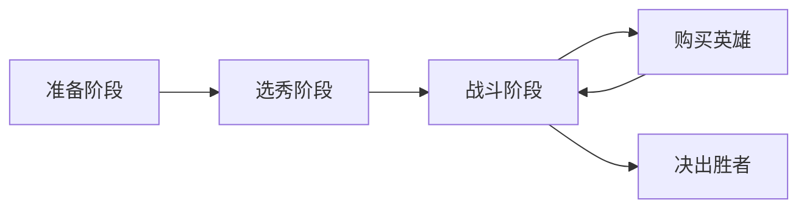

# 新手入门完全指南

## 欢迎来到金铲铲之战！

如果你是第一次接触这款游戏，不用担心！本指南将带你快速上手。

## 基础概念

### 什么是金铲铲之战？

金铲铲之战是一款自走棋游戏，核心玩法是：

1. 购买英雄卡牌
2. 合理搭配阵容
3. 与其他7名玩家对战
4. 成为最后的赢家

### 游戏流程



---

## 核心机制

### 1. 人口与经验

- **升级人口**需要消耗金币
- 每回合自动获得经验
- 人口越高，可上场英雄越多

| 人口等级 | 消耗金币 | 场上英雄数 |
|---------|---------|-----------|
| 4 → 5   | 4金     | 5个       |
| 5 → 6   | 8金     | 6个       |
| 6 → 7   | 16金    | 7个       |
| 7 → 8   | 24金    | 8个       |
| 8 → 9   | 32金    | 9个       |

### 2. 利息系统

> **重要**：每10金币产生1点利息，最多5点！

保持50金币可以获得最大利息收益。

### 3. 英雄星级

- 3个1星 = 1个2星
- 3个2星 = 1个3星
- 星级越高，属性越强

---

## 新手推荐阵容

### 简单上手阵容

这套阵容容易找牌，适合新手练习：

**配置：**
- 4战士 + 4射手
- 主C：射手核心
- 前排：战士坦克

**为什么推荐？**

1. ✅ 英雄容易获得
2. ✅ 不吃装备
3. ✅ 稳定性高
4. ✅ 容易理解

---

## 常见错误

### ❌ 错误1：过早升人口

很多新手喜欢快速升人口，导致经济崩盘。

**正确做法：**
- 保持经济稳定
- 合理升级人口
- 优先追质量

### ❌ 错误2：乱拿装备

选秀时随便拿装备，导致无法合成关键装备。

**正确做法：**
- 提前规划
- 按需拿取
- 考虑后续合成

### ❌ 错误3：死板照搬阵容

不看局内情况，死板照搬网上阵容。

**正确做法：**
- 灵活应变
- 根据牌库调整
- 观察对手

---

## 进阶技巧

### 经济运营

```
前期：保持连胜/连败
中期：成型阵容
后期：追星或all-in
```

### 装备分配

1. 优先给主C
2. 其次给前排
3. 最后给辅助

### 站位调整

根据对手调整站位是制胜关键！

---

## 学习路径

推荐的学习顺序：

1. **第一周**：熟悉基本操作
2. **第二周**：学习一套简单阵容
3. **第三周**：了解经济运营
4. **第四周**：学习多套阵容

---

## 推荐资源

- 📺 B站教学视频
- 📖 官方攻略网站
- 💬 玩家交流群

---

## 结语

金铲铲之战是一款策略性很强的游戏，需要时间去理解和掌握。不要气馁，慢慢来，你一定能成为高手！

祝你游戏愉快！🎮

---

**下一步阅读：**
- [阵容推荐](/guides/lineup-guide)
- [装备合成表](/guides/equipment-guide)
