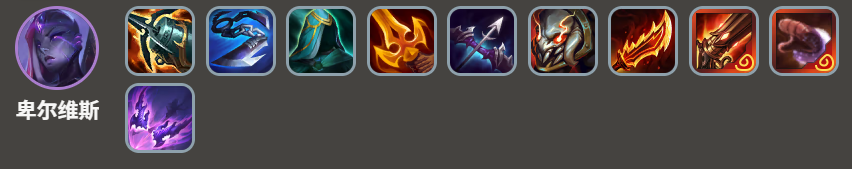
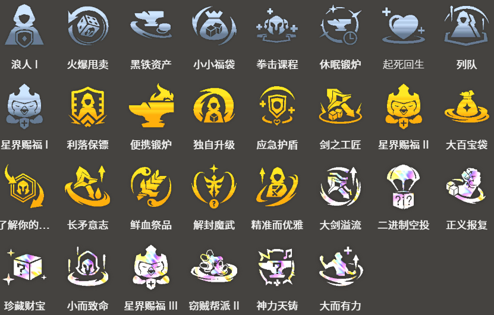

<!-- tags: 战士, 4费 -->
<!-- cover: dataTFT (25).png-->
<!-- backup: belveth-aatrox -->

# 裁决 卑尔维斯

## 📖 概要

以战士装备 过渡时可以使用的4费阵容。

阵容中有较多自由位置，容易采用抽到的5费英雄。

***斯维因***、***贝蕾亚***、***普朗克***、***安蓓萨***、***卑尔维斯***、***亚托克斯***这6个是确定位置，另外2个位置是**虚空**+自由位置。

可以用***科加斯***和***龙女***组成**主宰**4，或者在空位加入***奥恩***进行发育，或者采用***峡谷先锋***作为主坦克等，这是扩展性很广的阵容之一。

## 🎯 前置条件

2**虚空**的装备是武器时

制作饮血剑或正义之手等装备时

## 😀 最终阵容
.png>)

## 🎒 装备优先级

**卑尔维斯**

**亚托克斯**

优先制作***亚托克斯***解锁所需的饮血剑，以及***卑尔维斯***的装备。

本阵容的主C始终是***卑尔维斯***，所以***亚托克斯***的其他装备优先度较低。

## 🎯 强化符文

如果有星界赐福 II的话，***亚托克斯***的解锁会变得非常容易。

由于***费德提克***、***安蓓萨***等可以作为副C的单位很多，所以装备类强化符文的优先度较高。

## 🔓 解锁条件

**泰达米尔**
战斗中配置：装备2个装备的***艾希***
在解锁***亚托克斯***时可能会需要。在野怪回合等提前解锁。

**亚托克斯**
8级以上+战斗中配置：全能吸血达到40%开始战斗的英雄
如果回血类装备只有饮血剑，解锁时需要6**裁决战士**，需要注意这一点。

**峡谷先锋**
在8次对战中触发"虚空"
如果前期就出了**虚空**，可以作为主坦克候选人

来源: tftips