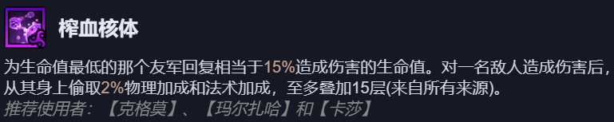
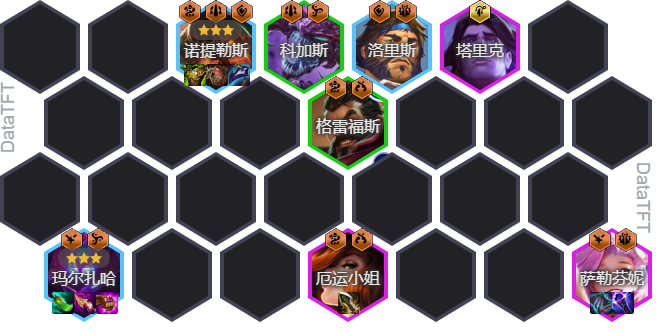

<!-- tags: 三费赌狗, 榨血核体 -->
<!-- cover: dataTFT (1)-1.png-->
<!-- backup: bloodburst-3star -->

# 榨血核体 蚂蚱

## 💎 阵容核心
阵容核心是榨血核体机制，主要追3星玛尔扎哈。

诺提勒斯可通过比尔吉沃特商店购买或自己追三。

## 🌱 前期过渡
- 可选择皮城单位过渡
- 或使用低费耀光使单位过渡
- 七级刷新商店寻找核心单位

## ⭐ 最终阵容

## ⏱️ 运营节奏

**七级阶段**
- 刷新商店追3星玛尔扎哈和诺提勒斯

**八级选择**
- 根据对手情况决定是否升八级
- 可补充塔里克或斯卡纳

## 🎒 装备分配

**诺提勒斯（前排）**
- 肉装（护甲、魔抗类装备）

**萨勒芬妮（功能位）**
- 功能装备（回蓝、辅助类装备）

**厄运小姐或洛里斯（输出位）**
- 物理装备（攻击、暴击类装备）

---

**来源**: 金铲铲剑神