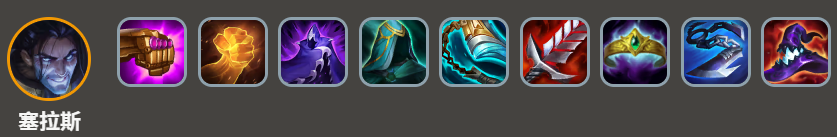
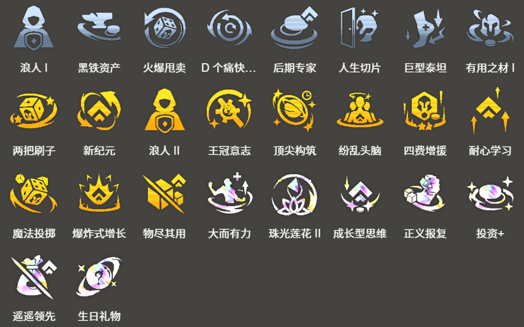

<!-- tags: 德玛西亚, 高费阵容, 后期成型 -->
<!-- cover: dataTFT (43).png -->
<!-- backup: demacia-late-game-comp -->

# 法师 塞拉斯

## 🎯 阵容概述

这是一套通过**德玛西亚**轴过渡的5费阵容。

完成时拥有全阵容中最顶级的强度，但成型难度极高是其特点。

<u>基本思路是在8级时开出7德玛西亚</u>，解锁加里奥的同时，升到9级后一次性完成阵容转型。

使用加里奥时，需要将塔里克、希瓦娜、费德提克、斯提克斯中的任意一个位置换成**德玛西亚**单位，激活正义巨像效果。

## 🚀 前置条件

当使用娑娜、嘉文四世等**德玛西亚轴**能够连胜过渡时

当**低调炫耀**中拿到安妮时

当拿到强行冲击9级的强力经济类**强化符文**时

## 😶‍🌫️ 最终阵容
.png>)

## 🎒 装备配置

**安妮**

**塞拉斯**

**提伯斯**

由于要经过**7德玛西亚**，先用拉克丝能够使用的装备，从朔极之矛、珠光护手、蓝霸符等**法师装备**开始制作。

需要注意的是，安妮的技能最终会带有燃烧/重伤效果，所以日炎斗篷、莫雷洛秘典的优先级较低。

<u>安妮能否尽快放出第一个技能至关重要</u>，所以尽量给她装备朔极之矛、蓝霸符、适应性头盔、纳什之牙等**回蓝装备**。

## 🤩 德玛过渡
.png>)

## 🔓 英雄解锁

**波比**
- 战斗配置：装备2个装备的「德玛西亚」或「约德尔人」单位
- 德玛西亚过渡时需要

**加里奥**
- 战斗配置：总计星级等级12的「德玛西亚」单位
- 虽然不是必须的，但在开出**7德玛西亚**的时机解锁的话，最终阵容会更加稳固

**塞拉斯**
- 卖出1个2星嘉文四世 + 卖出1个2星盖伦 + 卖出1个2星拉克丝

## 🎯 强化符文

来源:tftips

【阵容码】#法师95#MjE5OTgwMDYyNjAzNDUwODQxNzY2NDE5NjExODM4