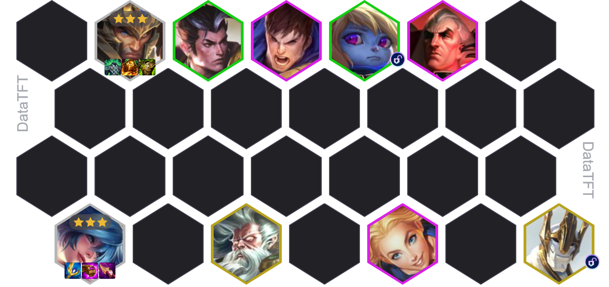
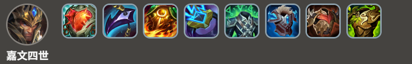
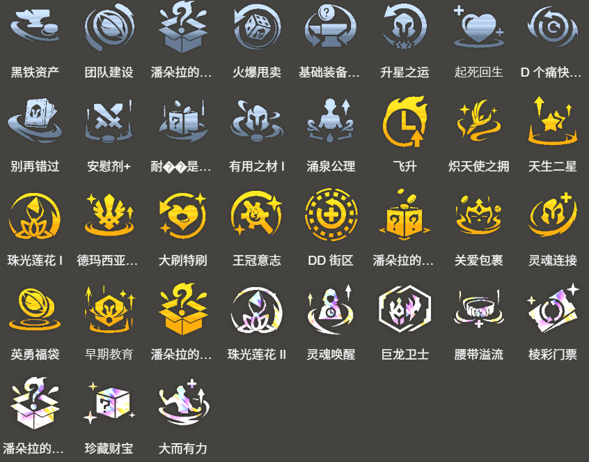

<!-- tags: 赌狗, 1费, 嘉文四世 -->
<!-- cover: dataTFT (1).png -->
<!-- backup: demacia-sona-reroll-comp -->

# 德玛西亚 娑娜

## 💡 概要

这是一套以**德玛西亚**1费单位为核心的3星赌狗阵容。

这套阵容的优势在于：前置条件清晰明确，不需要复杂的变阵和解锁操作，非常适合新手玩家上手。

## 🎯 前置条件

**娑娜**数量多的情况良好时可以考虑。

作为参考标准，<u>如果2-1阶段前能拿到娑娜2星就可以直接冲这套</u>。

另外，以下强化符文也适合决定打这套阵容：
- **炽天使之拥** / **宝宝学院**等本阵容专属的强力强化符文
- **棱彩门票**等适合重开阵容的强力经济强化符文

## ⭐ 最终阵容

## 🔄 D牌策略

阶段2期间不升人口，优先攒利息等待时机。

如果拿到耐心是一种美德等免费刷新的强化符文，或者经济比较宽裕的情况下，可以在2-2时刷4次牌，争取解锁**巴德**。

<u>攒够50利息后开始慢D牌</u>，目标是嘉文四世和娑娜的3星。

嘉文四世的3星虽然不是必须的，但他的全队增益效果非常优秀，建议尽量追三星。

阵容成型后开始升人口，8人口时追求盖伦和拉克丝的2星。

## 🎒 装备优先级

**娑娜核心装备：**

**嘉文四世核心装备：**

优先给娑娜做装备。

基本上从大天使之杖、珠光护手、纳什之牙、海克斯科技枪刃这几件娑娜适配装备中选择合成。

如果有宝宝学院等能补足娑娜法术加成的强化符文，推荐做海克斯科技枪刃 / 珠光护手 / 纳什之牙。

如果有炽天使之拥，推荐做海克斯科技枪刃 / 大天使之杖 / 大天使之杖。

## 🛡️ 主坦优先级

盖伦 2星 > 嘉文四世 3星 > 盖伦 1星 > 嘉文四世 2星

## 🔓 解锁英雄

波比
- 战斗中上场条件：装备2件装备的"德玛西亚"或"约德尔人"单位

加里奥
- 战斗中上场条件："德玛西亚"单位总星级达到12

## ⭐ 强化符文推荐

来源：tftips
