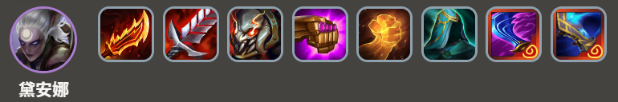
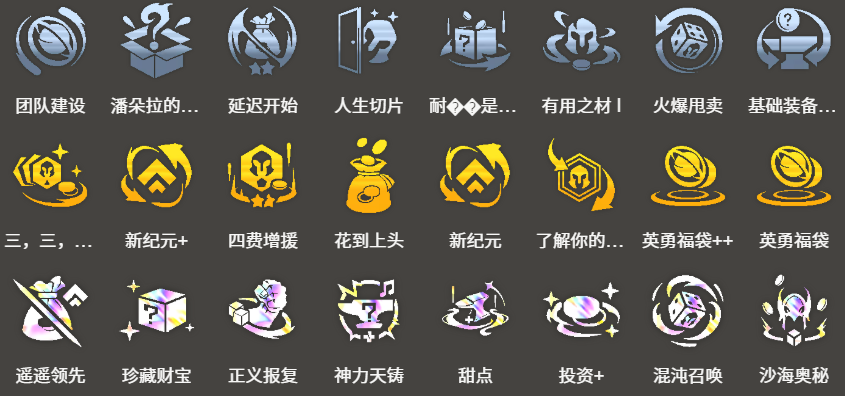

<!-- tags: 刺客阵容 -->
<!-- cover: dataTFT (34).png -->
<!-- backup: diana-seraphine-zoe-comp -->

# 黛安娜 泽拉斯

## 🎯 阵容概述

这是一套用**黛安娜**、**萨勒芬妮**和**泽拉斯**从敌方后排开始击破的阵容。

为了解锁**黛安娜**，需要蕾欧娜达到2星，所以想<u>在7级时D牌，蕾欧娜俩星进行解锁</u>。

如果有其他坦克两星或者三星了，而蕾欧娜还没到3星，可以换成其他单位也没问题。

## 🚀 前置条件

阶段2有蕾欧娜的时候

能用次级英雄复制器追蕾欧娜2星的时候

有**黛安娜**装备的时候

## 😶‍🌫️ 最终阵容
.png>)

## 🎯 阵容站位

想瞄准敌方左角后排时，把**黛安娜**放在A3（前排从左数第3个位置）；想瞄准右角后排时放在A5（前排从右数第3个位置）。

**萨勒芬妮**要和对手后排对角放置，保证第5次技能打击到对手。

## 🎒 装备配置

**黛安娜**

**黛安娜**

**泽拉斯**

**萨勒芬妮**

**黛安娜**的装备鬼索的狂暴之刃和泰坦的坚决是必需品，剩下1个格子可以堆全能吸血装备。合成装备中饮血剑最强力。

和神器适配性很好，建议积极选择。

饮血剑的替代选择：智慧末刃、探索者的护臂、死亡之蔑

鬼索的狂暴之刃的替代选择：三相之力、连指手套、巫妖之祸

**泽拉斯**最大法力值很高，所以想积极堆朔极之矛、蓝霸符、适应性头盔。

## 😶‍🌫️ 阿兹尔来之前
.png>)

## 🔓 英雄解锁

**黛安娜**
6级以上+战斗配置：装备3件装备的2星蕾欧娜

**泽拉斯**
阿兹尔在3场战斗中交替胜利和失败（每次解锁"恕瑞玛"难度都会提升！）
血量有富余的时候，建议故意输掉来解锁。

## 🎯 强化符文

团队建设，英勇福袋<u>能立即2星蕾欧娜</u>非常强力。

因为可以做出**黛安娜**的完美装备

潘朵拉的装备，基础装备自助餐是理想选择

来源:tftips

【阵容码】#戴安娜#MjE5OTgwMDYyNjAzNDUwODQxNzY1ODk0NzQyNjQ5