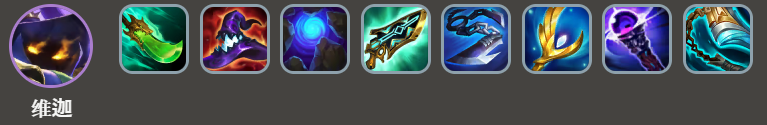
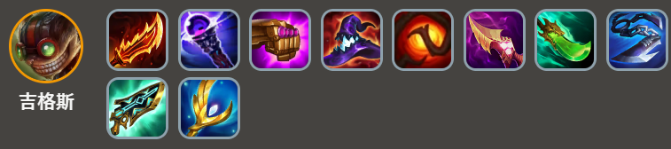
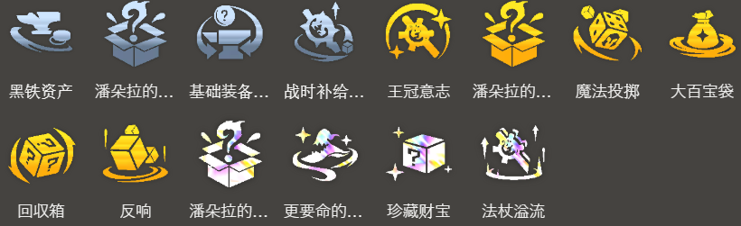

<!-- tags: 运营,8人口,AP -->
<!-- cover: dataTFT (8).png -->
<!-- backup: double-deathcap-veigar -->

# 双帽 维迦

## 🎯 概要

只有能做出2个**灭世者的死亡之帽**时才能玩的阵容。

通过**潘朵拉的装备**、**反响**、**更要命的帽子**、**法杖溢流**等特定强化符文才能走这个阵容。
其他像遇到波比（装备锻造器）等情况也可以尝试。

基本上是用**约德尔人**8人口来玩，但如果从**法杖溢流**或**魔法投掷**等强化符文突然拿到无用大棒时，不必强行凑约德尔人也OK。

## 🎮 前置条件

拿到**潘朵拉的装备**等能做出2个灭世者的死亡之帽的强化符文时。

## ⭐ 最终阵容
.png>)

## 🎒 装备

**维迦**

**吉格斯**

维迦需要2个灭世者的死亡之帽来解锁，但2个都给维迦太过剩了，理想情况是1个转移给吉格斯，再给其他装备。

灭世者的死亡之帽+（朔极之矛或蓝霸符）+（强袭者的链枷或海克斯科技枪刃）是理想搭配。

维迦技能效果自带暴击判定，所以不需要珠光护手。

Lv8阶段，吉格斯的武器先给菲兹用来过渡。

## 🔓 解锁

**可酷伯与悠米**
Lv7以上+战斗配置：合计星级6的「约德尔人」、「斗士」、「神谕者」

**凯南**
战斗配置：战斗中合计星级7的「艾欧尼亚」、「约德尔人」、「护卫」

**菲兹**
Lv7以上+战斗配置：5种「约德尔人」或「比尔吉沃特」单位

**维迦**
Lv7以上+战斗配置：装备2个「灭世者的死亡之帽」的单位

## 🎯 强化符文

---

来源：tftips
