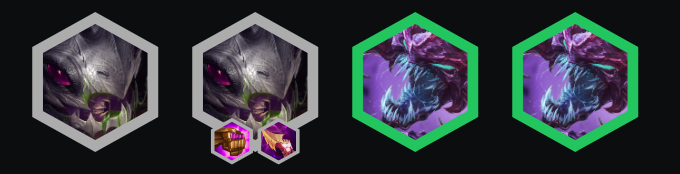
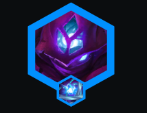

<!-- cover: dataTFT (9).png -->
<!-- backup: double-trouble-malzahar -->

# 好事成双 蚂蚱

## 🎯 提示

只在有**好事成双**时玩这套阵容。

坦克优先级: 诺提勒斯3星 > 洛里斯3星，但给谁做装备取决于你拿到谁更多。

**虚空**变异优先级: 榨血核体 > 喷吐棘刺 > 肾上腺素模块。

## 🚀 前期构成

## ⭐ 最终阵容
.png>)

## 📊 二阶段

围绕任何能拿玛尔扎哈装备的AP开局打。

只要你连胜且经济好，具体用什么不重要。

## 📊 三阶段

攒经济保持连胜。

很多时候，升级单位会失去**好事成双**的价值反而让你变弱。

所以考虑等第4个单位或者等战斗开始后再买。

## 📊 四阶段

升到7级并<u>慢D找玛尔扎哈3星、诺提勒斯3星</u>和其他**好事成双**单位。

给萨勒芬妮做辅助装备。

## 🔄 神器

## 🎯 强化符文

## ⭐ 强化符文优先级
战力 > 经济 > 装备

## 🎒 装备优先级

来源: TFT Academy
