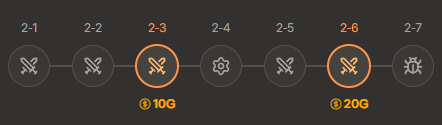

<!-- backup: economy-management-tips -->

# 经济管理小贴士

## 危机时刻果断花光金币

**💡 这是什么意思？**

<u>当你的生命值降到30左右时，就要果断花光金币</u>。

如果对操作速度没信心，<u>不必过分纠结50金币的利息线</u>，生命值开始下降时就可以逐步花掉金币来稳住局势。

 **🎯 要点**

如果你确信自己最终阵容碾压所有对手，那可以冒险撑到最后一刻再花金币。

## 2阶段要注意10/20金币线

**💡 这是什么意思？**

以2-3回合结束时持有10金币、2-6回合持有20金币为目标。

如果会跌破这个金币线，最好卖掉弈子来保持经济。

 **🤔 为什么？**

**前期利息**的有无会对后续对局走向产生重大影响。

如果跌破这个金币线，往往会导致经济崩盘 最终阵容难成型。

来源: tftips
