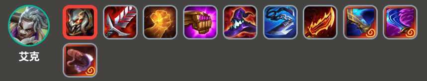
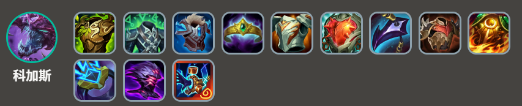
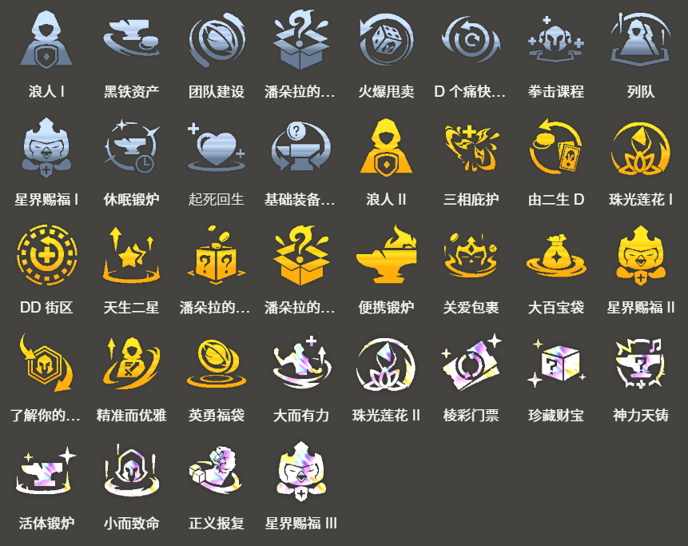

<!-- tags: 推荐新手, 冷门阵容 -->
<!-- cover: dataTFT (13).png -->
<!-- backup: ekko-chogath -->
# 艾克 科加斯

## 📖 概要

以***艾克***和***科加斯***的3星为目标的2费快速D牌阵容。

由于几乎不需要解锁条件，不需要复杂的盘面调整，也推荐给新手玩家。

另一方面，<u>后期发展比较困难，依赖战士单位作为主C</u>，想要获得第1名比较困难。

## 🎯 前置条件

第1阶段拿到***艾克***并且有装备时

由***由二生D***等，可以决定赌2费快速D牌的强力强化符文时

## 🎯 最终阵容
.png>)

## 🔄 快速D牌

在6级进行慢D牌。

由于是后期上限不高的阵容，<u>特别希望在阶段3保持连胜</u>。

第2阶段期间不升经验，<u>最大化获取利息</u>。

3-2升到6级，<u>以***艾克***、***科加斯***2星加上2个***耀光使***为目标进行刷牌</u>。

重新存到50金币，在6级进行慢D牌直到***艾克***和***科加斯***都达到3星。

***蔚***和***妮蔻***也是同费单位，但由于其他很多阵容都会使用，只有在特别顺的情况下才追3星。

完成3星后立即升到7级、8级来提升羁绊。

## 🎒 装备优先级

**艾克**

**科加斯**

优先制作***艾克***的理想装备***饮血剑***、***泰坦的坚决***、***正义之手***。

其中***泰坦的坚决***是特别必需的。

主坦克是***科加斯***。由于要瞄准***艾克***的理想装备，<u>需要妥善分配剩余材料给***科加斯***的防具</u>。

## 🎯 强化符文

## 🔓 解锁条件

**辛吉德**
场上配置：4种不同的「***祖安***」或「***主宰***」，玩家失去35生命值

<u>会自动解锁，所以不需要特别注意</u>。

来源: tftips