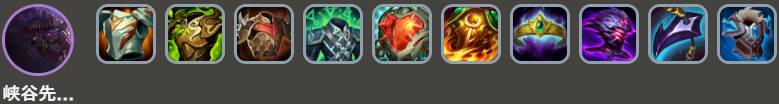
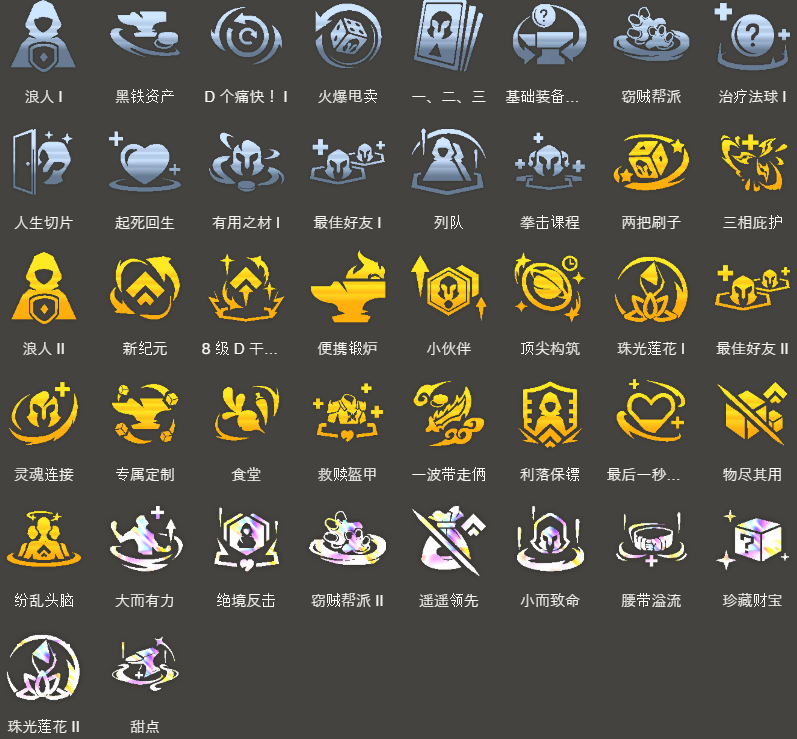

<!-- tags: 8级4费 -->
<!-- cover: dataTFT (4).png -->
<!-- backup: herald-void-kaisa -->

# 斗士 卡莎

## 🚀 前期

通过**虚空**来获得胜利进行的阵容。

**峡谷先锋**和**卡莎**分别通过解锁保证各1张,事故率低,是稳定感很强的阵容。

## 🎯 前置条件

・在2-3回合前出现<u>虚空2</u>时

推荐在虚空早期出现时向这个阵容过渡,因为希望在一般4费阵容的刷牌时机4-2回合之前解锁**峡谷先锋**。

## ⭐ 最终阵容
.png>)

## 🎒 装备

**峡谷先锋**

**卡莎**

**吉格斯**

**卡莎**是物理系・魔法系两种装备都能装备的单位,所以从哪种开始做都OK。

不过,物理和魔法不要混搭,<u>要统一成其中一种</u>。

在给**卡莎**做了魔法系装备的情况下,后期可以转给**吉格斯**。

最终要注意让**卡莎**和**吉格斯**两人都能拿到装备。

## 🎯 强化符文

## ⭐ 解锁

**卡莎**

Lv7以上+战斗配置: 装备3件装备的"狙神"单位

本阵容的主C,给克格莫装备装备进行过渡,然后直接解锁

**峡谷先锋**

在8次对战中发动"虚空"

**吉格斯**

Lv9以上+战斗配置: 装备3件装备的"约德尔人"或"祖安"

如果**卡莎**和**吉格斯**两人都拿不到装备就不用强行组入。

只在有两人份武器时优先追求。

**沃利贝尔**

Lv8以上+战斗配置: 以3800生命值开始战斗的单位

**可酷伯与悠米**

Lv7以上+战斗配置: 总星级为6的"约德尔人"、"斗士"、"神谕者"

推荐在3-7的野怪回合提前解锁。

没余力的话不用特别在意也OK

来源：tftips