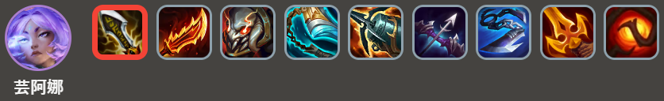
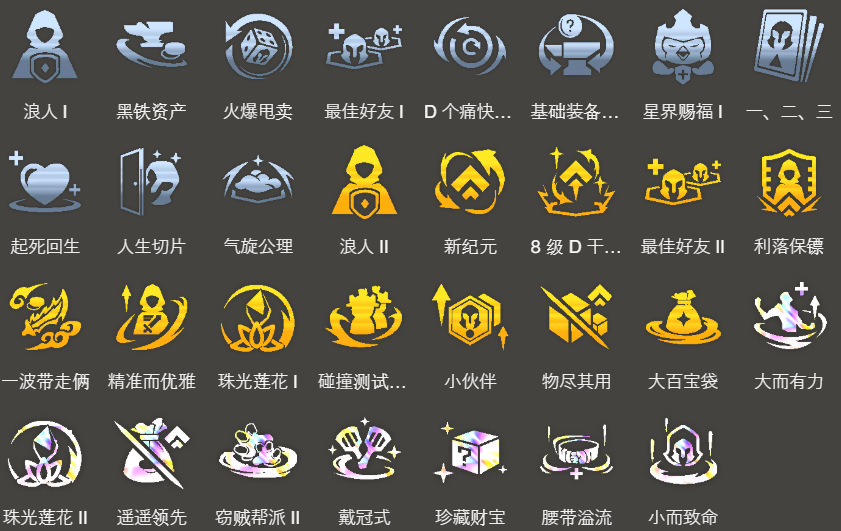

<!-- tags: 新手，95 -->
<!-- cover: dataTFT (6).png -->
<!-- backup: ionia-sett -->

# 艾欧尼亚 瑟提

## 🎯 阵容概要

围绕艾欧尼亚体系构建的均衡阵容。

坦克、物理系C位、魔法系C位三者配比极佳,装备极易成型。
不需要复杂的变阵和拆卸装备,非常推荐新手使用。

**艾欧尼亚5**优先启动,剩余位置放入单卡,能发挥作用的强力单位。
Lv8阶段很难组入5费单位,建议放塔里克斯卡纳。

另外,为了让**瑟提**通过**腕豪**效果尽早退场,需要将其放置在容易吸引敌方火力的位置。

## 😶‍🌫️ 前期过渡
.png>)

## 🎯 前置条件

- 使用**慎烬**等艾欧尼亚单位进行过渡时
- 拿到鬼索的狂暴之刃无尽之刃等装备过渡时
- 获得艾欧尼亚纹章时

艾欧尼亚每局游戏效果都会变化。
特别是出现金币系的『繁荣之路』和『启迪之路』时,强烈推荐主打艾欧尼亚进行过渡。

## 🎯 装备推荐

瑟提

芸阿娜

孙悟空

基本上使用**烬**进行过渡,因此优先制作鬼索的狂暴之刃等**芸阿娜**的装备。

**瑟提**的装备也很重要,但无论给什么都能发挥一定作用,因此建议先做完芸阿娜孙悟空的装备后,用剩余散件来制作。

## ⭐ 最终阵容
.png>)

## 🎯 解除条件

**凯南**

战斗中配置:战场上「艾欧尼亚」、「约德尔人」、「护卫」的星级总和达到8

不需要特别在意,主打艾欧尼亚体系进行游戏的话会自动解除。
如果能在2-7野怪回合刻意解除的话最好去做。

**瑟提**

Lv8以上+战斗中配置:战场前两排只有1个单位

解除本身很简单,但要注意别忘记摆放位置。

## 🎯 强化符文推荐

来源: tftips