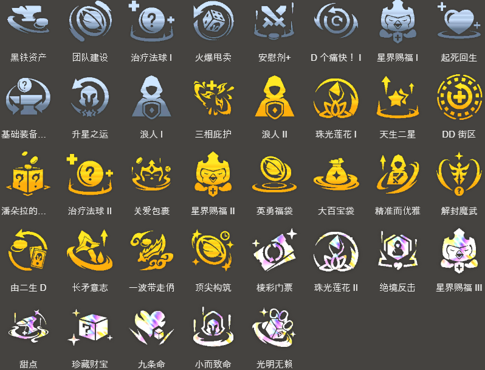

<!-- tags: 2费赌狗，冷门 -->
<!-- cover: dataTFT (14).png -->
<!-- backup: ionia-yasuo-yone -->

# 亚索 永恩

## 🎯 概要

目标是拿到**3星亚索**的2费快速D牌阵容。

和常规快D阵容不同,这是2费和4费双C阵容,需要一定熟练度。

本构成的主C是**永恩**,亚索只是永恩升2星前的过渡,定位是副C。

## 🎮 前置条件

1阶段就拿到了**亚索**,并且抽到了类似**英勇福袋**这种支持快D的强力符文。

和其他快D阵容不同,本构成不追求亚索以外的3星,所以亚索的数量特别重要。

## ⭐ 最终阵容
.png>)

## 🔄 快速D牌

2阶段期间不升级,最大化利息等待。

不过如果2星慎和烬都做出来了,用**艾欧尼亚**体系连胜也可以升级抢血。

<u>3-2升到6级</u>,快D到**2星亚索**。

之后重新攒利息,慢D到**3星亚索**为止。

为了后面做永恩,尽量在有经济余裕的情况下做出3星亚索。

理想状态是不破利息,保持50金的情况下做出3星亚索。

## 😶‍🌫️ 最终阵容（塞拉斯版）
.png>)

## 🛤️ 艾欧尼亚之道

**艾欧尼亚之道优先级**:
灵魂 > 繁荣 > 超凡 > 启迪 > 利刃

不过相比选哪条道,<u>更重要的是亚索多快能升3星</u>,所以2-1只要条件合适选哪条道都行。

## 🎒 装备

**亚索**:

**永恩**:

想同时给永恩和亚索都配齐装备。

注意永恩的技能伤害同时受物理加成和法术加成影响,所以无尽之刃、最后的轻语、海妖之怒这类武器和他不太搭。

把无尽之刃、死亡之刃这类武器给亚索,鬼索的狂暴之刃、水银这类提攻速的给永恩,这样分配比较合理。

## 🔓 解锁

**凯南**:

战斗中配置:战斗中总星级达到8的"艾欧尼亚"、"约德尔人"、"护卫"

**永恩**:

战斗中配置:3星亚索
注意解锁需要1回合。

**瑟提**:

8级以上+战斗中配置:战场前2排只有1个单位

**塞拉斯**:

卖掉1个2星嘉文四世 + 卖掉1个2星盖伦 + 卖掉1个2星拉克丝

最终成型时解锁**塞拉斯**也很推荐。

快D期间提前把2星嘉文四世卖掉,8级有余力就去解锁。

## 🎯 强化符文

来源:tftips