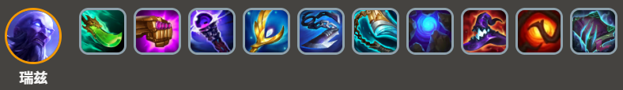
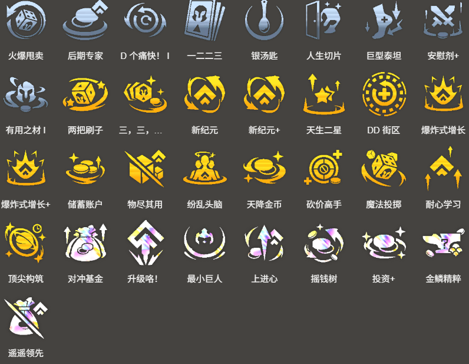

<!-- tags: 5费阵容,后期阵容 -->
<!-- cover: dataTFT (3).png -->
<!-- backup: jiggs-ryze-comp -->

# 吉格斯 瑞兹

## 📋 概要

**约德尔人**或**艾欧尼亚**过渡时，可以平稳进入后期的5费双C阵容。

**吉格斯**和**瑞兹**解锁都需要1回合，而且解锁条件有点小门道，需要习惯一下。

## 🎯 前置条件

拿到这些强力金币系强化符文的时候：升级咯！上进心等

用**约德尔人**或**艾欧尼亚**经济路线过渡时, 拿到**鬼索的狂暴之刃**能连胜过渡时

## ⭐ 艾欧过渡

## ⭐ 约德尔过渡

## ⭐ 最终阵容
.png>)

## 🎒 装备

**吉格斯**

**瑞兹**

**吉格斯**的**鬼索的狂暴之刃**是必需的。

## 🔓 解锁

**吉格斯**

<u>等级9以上+战斗中放置</u>：装备3个装备的"**约德尔人**"或"**祖安**"

注意容易搞错的点，**克格莫**和**卡莎**即使装备3件装备也无法解锁。

**瑞兹**

<u>等级9以上+战斗中放置</u>：4个地域羁绊放在一起

2约德尔人 + **巨神峰** / **艾欧尼亚** / **皮尔特沃夫** / **祖安**中任选4个地域组合来解锁就行。

**凯南**

<u>战斗中放置</u>：星级总和达到8的"**艾欧尼亚**"、"**约德尔人**"、"**护卫**"

如果不是用**约德尔人**或**艾欧尼亚**过渡的话，一定要抱着解锁用的单位，争取在野怪回合时解锁。

## 🎯 强化符文

来源: tftips
