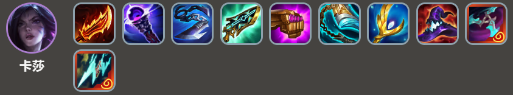
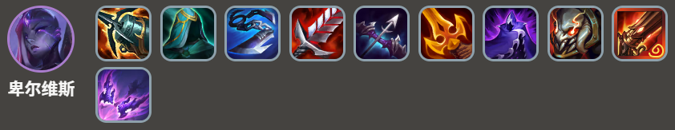
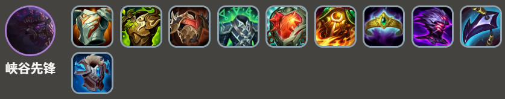
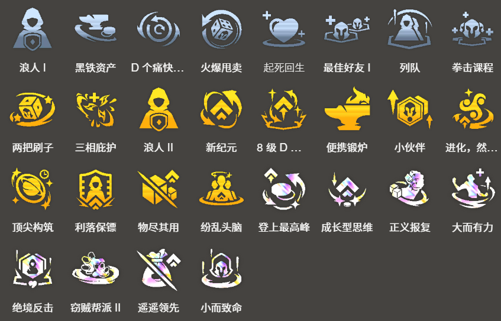

<!-- tags: 4费, 稳定 -->
<!-- cover: dataTFT (27).png-->
<!-- backup: kaisa-belveth -->

# 卡莎 卑尔维斯

## 📖 概要

前期以**虚空**连胜过渡时可以使用的阵容。

***峡谷先锋***和***卡莎***各自通过解锁保证有1张，所以事故率低，是安定感很高的阵容。

另一方面，由于难于采用5费英雄，如果最终无法连接到***纳什男爵***，瞄准第1名会变得困难。

## 🎯 前置条件

前期出了**虚空**，有希望取得连胜时

与***卡莎***相性很好的"肾上腺素模块"包含在**虚空**装备中时

有登上最高峰等，能够强行达到10级的希望时

## 😀 最终阵容
.png>)

## 🎒 装备优先级

**卡莎**

**卑尔维斯**

**峡谷先锋**

由于最终希望***卡莎***和***卑尔维斯***两方的武器都齐全，为了凑齐装备，希望***卡莎***带法系装备。

## 🎯 强化符文

## 🔓 解锁条件

**卡莎**
8级以上+战斗中配置：装备3个装备的"狙神"单位
本阵容的主C，给***克格莫***装备进行，然后就这样解锁

**峡谷先锋**
在8次对战中触发"虚空"

## 🤩 纳什男爵
.png>)

来源: tftips