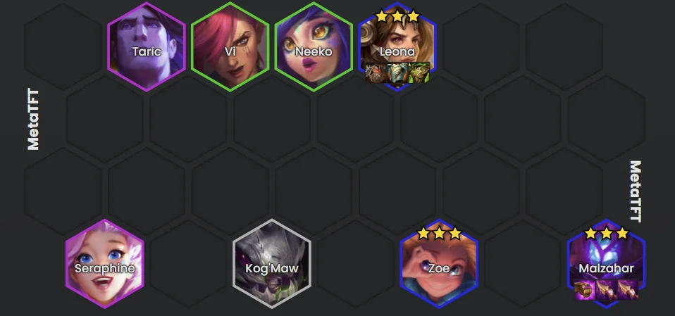

<!-- backup: leona-malz-zoe-reroll -->

# 玛尔扎哈 蕾欧娜 佐伊

## 💡 阵容概述

**蕾欧娜**、**佐伊**、**玛尔扎哈**加强后的强力赌狗。

**核心优势**：**蕾欧娜**晕眩 + **佐伊**爆发 + **玛尔扎哈**死后持续输出。

## 🎯 核心思路

**升3星优先级：玛尔扎哈 ＞ 蕾欧娜 ＞ 佐伊**

**前期策略**：连胜流。激进升级保连胜保血量，用血量换四阶段D 3星的资本。

**成型等级**：7级，2个巨神峰核心。前期灵活过渡，**克格莫**/**蔚**/**妮蔻**凑羁绊即可。

**最终阵容示例**

## 🎮 各阶段运营

**阶段二**：
- 积极打连胜
- 找对子、2星棋子来赢场面
- 为了保连胜可以牺牲利息
- 必要时提前升级抢节奏

**阶段三**：
- 保持连胜，尽量激进
- 为了连胜可以提前升7
- 7级D牌把场面补2星
- **蕾欧娜**和**佐伊**2星能撑场面，打赢四阶段的弱阵容

**阶段四**：
- 重建崩掉的经济
- 必要时拿经济强化符文
- HP高就容许几波败场，攒钱D 3星
- 差1-2张就3星时可以梭哈，一波起飞

**阶段五**：
- 出了3星就升8，加入**塔里克**（或**斯卡纳**）
- <u>注意站位，别让蕾欧娜被包围</u>

## ⚠️ 注意事项

### 资源过剩局不适合

"棱彩强化符文"或"峡谷迅捷蟹"等资源爆炸局，高费阵容四阶段就成型，容易被碾压。

**例外**：有"棱彩门票"可多D几轮，**黛安娜**3星作为可偷的4费单位。

### 虚空（变异）选择

**榨血核体 ＞ 喷吐棘刺**（肾上腺素模块不推荐）

选"喷吐棘刺"需给**蕾欧娜**带"振奋盔甲"，或给**佐伊**带"海克斯科技枪刃"补回复。

## 🎒 装备搭配

**玛尔扎哈**：珠光护手 / 纳什之牙 / 纳什之牙（或朔极之矛）

**蕾欧娜**：石像鬼石板甲 / 棘刺背心 or 巨龙之爪 or 第二件石板甲 / 振奋盔甲 or 坚定之心（双石板甲最优，注意别过多拿腰带做前排装）

**佐伊**：珠光护手 / 纳什 / 纳什（或剩余法强装）。3星基础伤害900，带珠光护手暴击1260（能秒4费1星坦克）。

## 🎯 强化符文选择

**阶段二**：有强力D牌强化就拿，没有就找能帮助连胜的装备系。

**阶段三**：根据二阶段结果和对局强度，选经济系或继续加强装备/战力。

**阶段四**：这里多半会拿经济强化符文。

来源: Reddit - CompetitiveTFT
