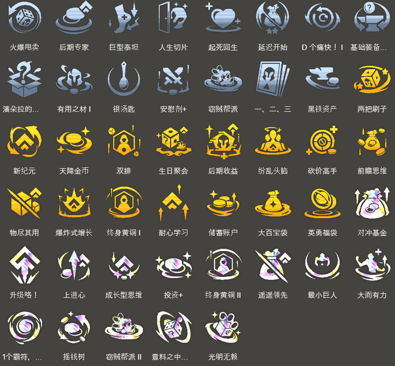

<!-- tags: 运营,高费,登顶 -->
<!-- cover: dataTFT (22).png -->
<!-- backup: mel-5-cost-leveling -->

# 梅尔 95

## 💡 阵容概述

5费核心的运营阵容。**梅尔**解锁条件大幅放宽，可玩性提升。

仍需大量金币，适合连胜进行或拿到强力经济强化符文时玩。

## 🎯 核心思路

**8级过渡**：

用 7诺克萨斯 保血量升9级。根据抽到的5费单位逐步转向最终阵容。

**灵活单位**：

费德提克/卢锡安与赛娜/塔里克 为自由位，可换成恕瑞玛单位或其他俩星5费。

**梅尔优先**：

<u>即使能直升9，也要在8级必抽安蓓萨来解锁梅尔</u>（她能生成光明装备，越早上场越好）。

## 🎮 前置条件

适合玩这套的情况：
- 拿到后期收益/升级咯！等强力经济强化符文
- 以赛恩/乐芙兰为核心，用诺克萨斯过渡
- 遇到"峡谷迅捷蟹"/"金币订购"等经济城邦

## ⭐ 过渡阵容
.png>)

## ⭐ 最终阵容
.png>)

## 🎒 装备搭配

**梅尔**：

（法力回复装备必带，她蓝条极高）

**塞拉斯**：

**卢锡安与赛娜**：

**斯维因**：

**装备思路**：<u>前期给乐芙兰装备，优先做法强装</u>。梅尔蓝耗高，必带适应性头盔/纳什/朔极之矛/蓝霸符之一。

剩余物理散件（大剑/反曲之弓）给千珏/卢锡安与赛娜，拳套做窃贼手套，尽量让多个5费都能分到装备。

## 🔓 解锁条件

**梅尔**：<u>8级以上 + 装备1件装备的安蓓萨战斗中阵亡</u>

**塞拉斯**：9级以上 + 卖掉1个2星盖伦（解锁前可用妮蔻代替）

## 🎯 强化符文推荐

来源: tftips
