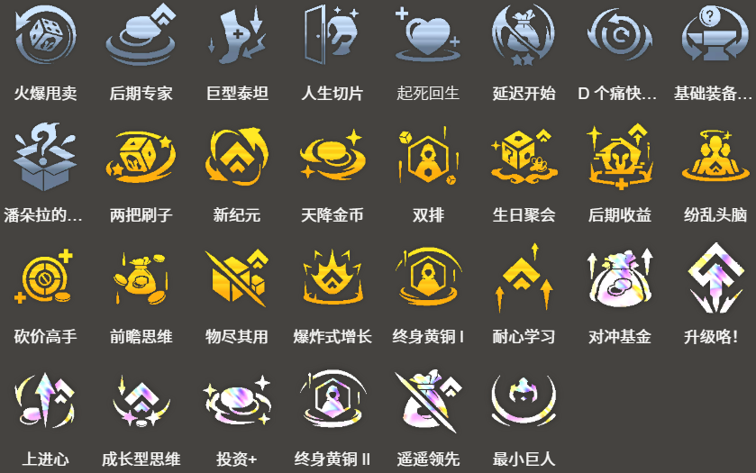

<!-- tags: 5费阵容,冲9,梅尔,卢锡安,后期转型,高费 -->
<!-- cover: dataTFT (64).png -->
<!-- backup: mel-lucian-level9-comp -->
# 梅尔95

## 🎯 阵容概述

这是一套在能够直冲9级时组成的5费英雄核心阵容。**蔚**、**妮蔻**、**斯维因**、**萨勒芬妮**、**希瓦娜**这5个单位是固定成员,其余4个位置可以根据抽到的5费英雄灵活搭配。

基本思路是围绕**梅尔**为核心来组建,但如果拿不到适应性头盔或者解锁条件较难完成时,也可以考虑使用**阿兹尔**、**千珏**等英雄进行变阵。

如果以**卢锡安与赛娜**作为输出核心,那么**枪手**羁绊就不需要了。**迅击战士**羁绊能为全队提供攻速加成,所以当使用千珏作为输出核心时,建议优先激活这个羁绊。

## 🔧 前置条件

**后期收益** / **升级咯!** 等能够直冲9级的强化符文出现时

阶段2能够取得连胜时(或者有连胜的可能时)

能够保持血量稳定推进,且拥有1个以上经济系强化符文的情况下,可以积极往这套阵容靠。

通过**比尔吉沃特**或**约德尔人**进行黑市积累,同时推进到9级的打法也很强。

## 😶‍🌫️ 最终阵容
.png>)

## 🎒 装备分配

**梅尔**

**卢锡安与赛娜**

<u>梅尔的吸蓝机制跟适应性头盔配合超猛</u>,所以要尽可能多做几个适应性头盔。理想情况是给梅尔叠3个适应性头盔,不过散件不够的话,缺的位置用其他法术装备顶上就行。

<u>选秀阶段全力抢适应性头盔的散件</u>。

多余的暴风之剑、反曲之弓等物理系散件给卢锡安与赛娜做装备,拳套就做成窃贼手套,要注意合理分配装备,让所有5费英雄都能拿到装备。

## 🔓 解锁条件

**梅尔**:携带1件装备的2星安蓓萨在战斗中阵亡

本阵容的主C。安蓓萨在其他阵容里也是热门单位,所以根据竞争情况,在8级时也可以考虑提前追2星安蓓萨。

## ⭐ 强化符文推荐

---

来源: datatft
