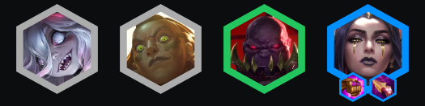
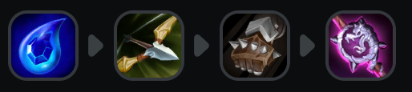
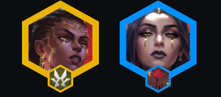
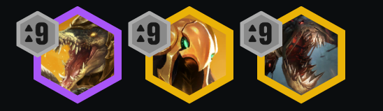

<!-- cover: dataTFT (13).png -->
<!-- backup: noxus-leblanc-atakhan -->

# 诺克萨斯 乐芙兰

## 🎯 提示

尽快通过给**赛恩**做装备来解锁**乐芙兰**。

**厄塔汗**从棋盘左侧召唤,所以你的破甲装备应该偏向棋盘中的左侧。

如果无法追3星**乐芙兰**,就转2星**梅尔**并在后期换装。

后期阶段,淘汰较弱的**诺克萨斯**单位如**德莱厄斯**和**贝蕾亚**,换上更强的单位。

## 🚀 前期构成

## 🎒 装备优先级

## ⭐ 最终阵容
.png>)

## 📊 二阶段

理想情况下从围绕**乐芙兰**和**诺克萨斯**的强势开局打。

如果你有物理加成装备 + **德莱文**,考虑把开局阵容转向不同的后期阵容。

## 📊 三阶段

升到6级并在可能的情况下打5**诺克萨斯**。

你也可以加入额外的**斗士**来解锁**可酷伯**的羁绊。

<u>1星带装斯维因 > 2星赛恩</u>。

## 📊 四阶段

如果你很富裕且有很多**乐芙兰**,考虑在7级追3星。

否则,升到8级并滴出完整的**诺克萨斯**阵容。

**梅尔**拿剩余的法力/法术加成装备。

## 🔄 特殊装备

## 🎯 强化符文

## ⭐ 强化符文优先级
装备 > 经济 > 战力

## 💪 阵容上限

来源: TFT Academy
