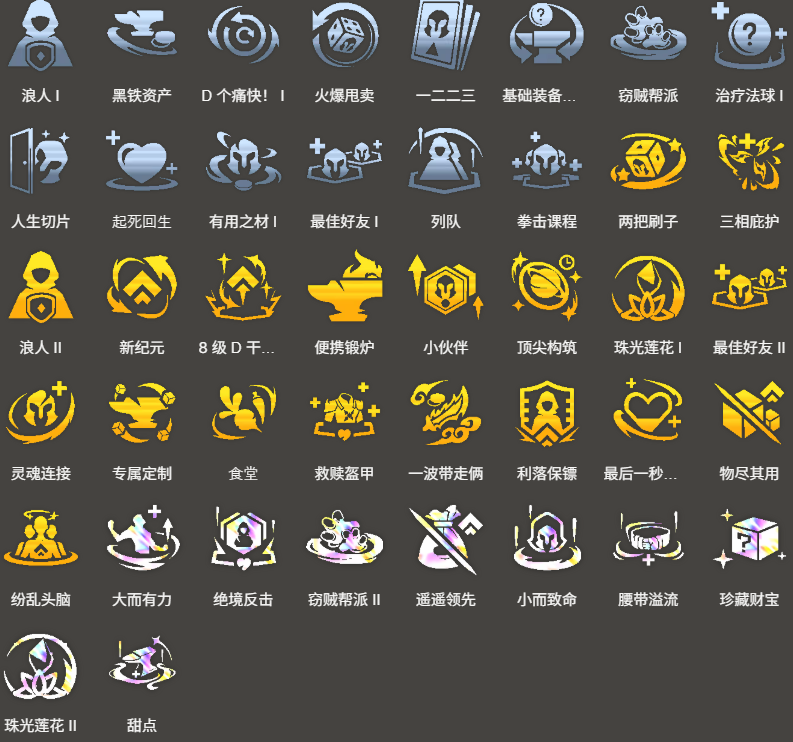

<!-- tags: 运营4费 -->
<!-- cover: dataTFT (5).png -->
<!-- backup: reksai-void-bilgewater-comp -->

# 卡莎 吉格斯

## 📋 概要

前期通过**虚空**取得连胜时可以玩的阵容。

**峡谷先锋**和**卡莎**都能通过解锁条件获得1张保障，所以翻车概率低，是一套稳定性很高的阵容。

## 🎯 前置条件

・2-3阶段之前出现**虚空2**

推荐在早期出现虚空时去玩，因为想在4-2回合（一般4费阵容的D牌时机）之前解锁**峡谷先锋**。

## ⭐ 最终阵容
.png>)

## 🎒 装备

**峡谷先锋**

**卡莎**

**吉格斯**

**卡莎**是能装备物理系和魔法系装备的单位，无论从哪个开始做都行。如果两种都能选，推荐做物理系装备。但物理和魔法不要混搭，要统一成其中一种。

给**卡莎**做魔法系装备的话，后期可以转移给**吉格斯**。最终要确保**卡莎**和**吉格斯**都有装备。

## 🔓 解锁

**卡莎**

<u>等级7以上+战斗中放置</u>：装备3个装备的"**狙神**"单位

本阵容的主C，给**克格莫**装备后过渡，然后直接解锁。

**峡谷先锋**

对人战斗中让"**虚空**"生效8次

## 🎯 强化符文

来源: tftips