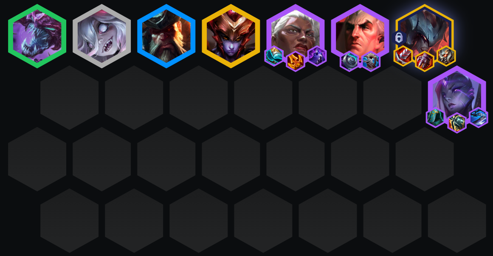
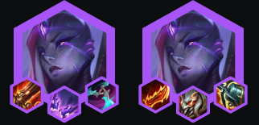
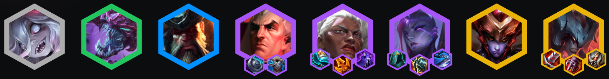
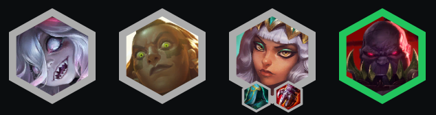
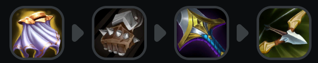
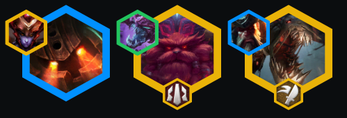

<!-- tags: 冷门, 战士 -->
<!-- cover: image-12.png -->
<!-- backup: set-16-442-belveth -->

# 卑尔维斯 安蓓萨

## ⭐ 最终阵容

## 💡 核心思路

**卑尔维斯**另一个版本。<u>当你拿到卑尔维斯且有希瓦娜时上场</u>。

## 📊 第2阶段

理想情况是用2星**奇亚娜** > 2星**贝蕾亚**拿装备开局连胜。也可以玩**以绪塔尔**或**比尔吉沃特**来获取资源。

## 📊 第3阶段

<u>如果连胜中，保持节奏并积极合装备</u>。利用比尔吉沃特商店获得免费升星。

## 📊 第4阶段

<u>升8级D 2星卑尔维斯+安蓓萨+前排</u>。尽可能拿战斗强化符文。灵活调整剩余位置。如果亚托克斯不合适，别急着上1星的。

## 🔄 神器选择

## 🎯 强化符文

## ⭐ 强化符文优先级
经济  > 装备 > 战力

## 🚀 前期构成

## 🎒 装备优先级

## 💪 灵活单位

来源：tftacademy
