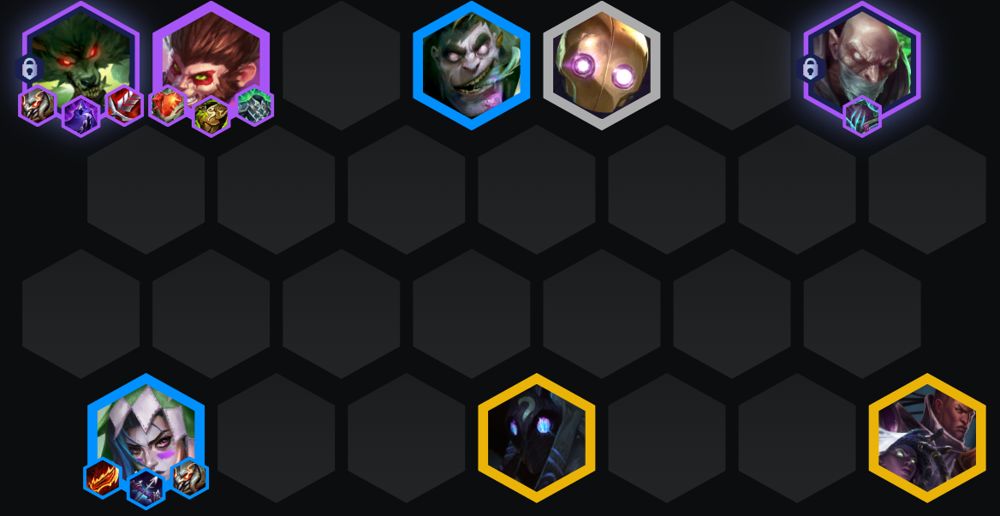
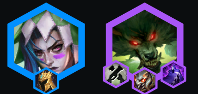
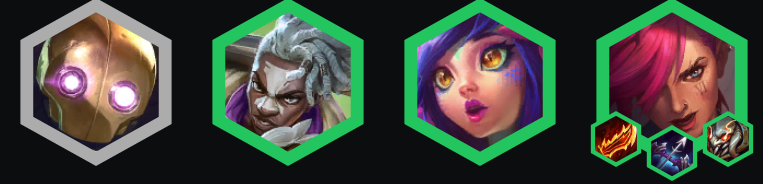
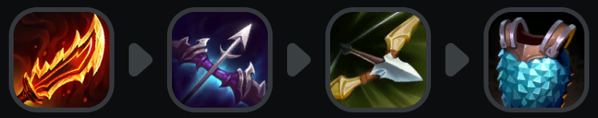
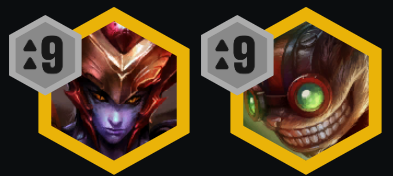

<!-- tags: 灵活阵容 -->
<!-- cover: image-5.png -->
<!-- backup: set-16-warwick-flex -->

# 祖安沃里克灵活阵容攻略

## 💡 核心思路

始终保持5祖安，围绕升级的4费坦克（**孙悟空**/斯维因/辛吉德）配坦克装。**金克丝**加强后，她的装备比**沃里克**更重要，但他也需要装备。**纹章**非常重要 - 留意祖安、枪手、主宰（4主宰）、斗士（放弃孙悟空打7祖安）、迅击战士（放弃千珏打7祖安）。

## ⭐ 最终阵容

## 📊 第2阶段

<u>用祖安蔚或贝蕾亚+奇亚娜开局连胜是理想情况</u>，但也可以连败快速上辛吉德。优先做金克丝装备，其次是沃里克装备。

## 📊 第3阶段

始终上场金克丝并给她装备。<u>如果连胜，可考虑提前升级以解锁沃里克</u>。如果连败严重，可在7级D一些金币找金克丝、蔚和蒙多俩星。

## 📊 第4阶段

<u>4-2升8级</u>，找2星沃里克、5祖安、以及任意升级的坦克（2星孙悟空 > 2星蒙多）。2迅击战士在千珏之前不太重要。9级时，用吉格斯替换布里茨，有装备时加入希瓦娜。

## 🔄 其他装备选择

## 🎯 强化符文

## ⭐ 强化符文优先级
经济 > 装备 > 战力

## 🚀 前期构成

## 🎒 装备优先级

## 💪 阵容上限

来源：tftacademy
