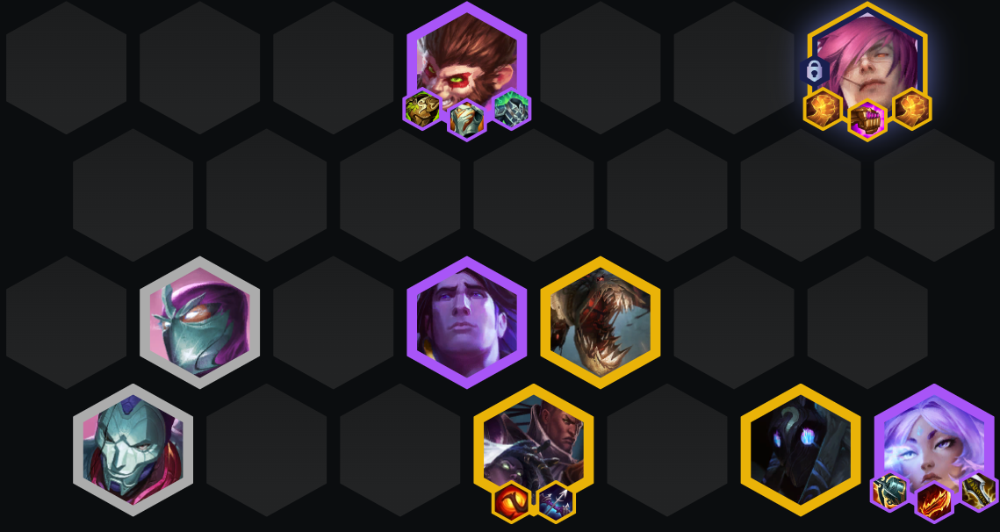
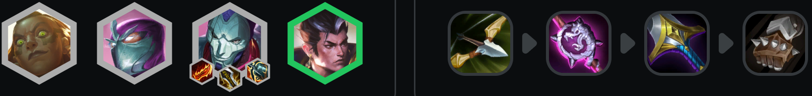
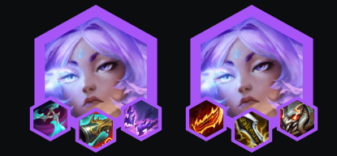

<!-- tags: 艾欧尼亚,芸阿娜,瑟提,孙悟空,斗士,护卫 -->
<!-- cover： image-8.png-->
<!-- backup: sett-yunara-ionia-comp -->

# 芸阿娜 瑟提

## ⭐ 最终阵容

## 💡 核心玩法

理想情况下从金币或经验的**艾欧尼亚**强化符文开局。可以灵活降级到3艾欧尼亚+优质前排的配置。**费德提克**和**塔里克**是可替换位置。装备优先级:**芸阿娜** > 坦克 > **瑟提**。

## 😶‍🌫️ 前期过渡

## 🎯 阶段2

理想情况下你拿到了给金币或经验的艾欧尼亚升级强化。直接合装备打连胜。围绕升级的**约德尔人**或**护卫**来搭配**凯南**。

## ⭐ 阶段3

如果你在玩艾欧尼亚,继续叠艾欧尼亚数量或者挂相关羁绊,比如**德玛西亚**、约德尔人、**斗士**等。拿不准的话,就多上前排。

## 🔧 阶段4

8级找**芸阿娜**和**孙悟空**。别忘了阶段4解锁瑟提。稳住之后冲9找5费。保持灵活,根据实际情况分配装备。如果血量不够上9，八级可以找**卑尔维斯** + **亚索**进行保分。

## 海克斯

## 适配神器

