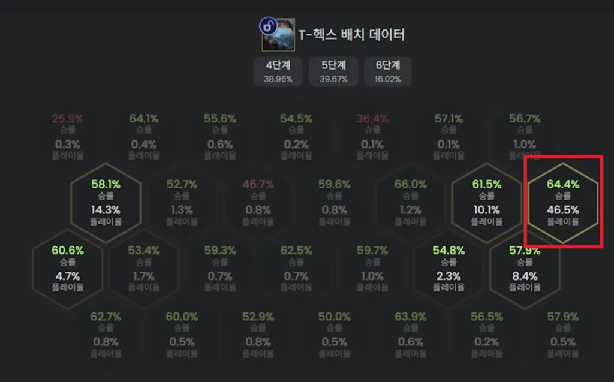

<!-- tags: 登顶阵容, 高难度  -->
<!-- cover: dataTFT (54).png -->
<!-- backup: t-hex-challenger-guide -->

# 海克斯霸龙

## 🚀 前期运营与单位优先级

**2-3阶段的金币投入**

在保持10金以上的情况下,把巴德上场。在利息不崩的范围内尽早把巴德升到2星,这样能提高胜利时带来高费单位或海克斯霸龙的概率。
.png>)

**升3星的优先级**

<u>凯特琳 > 嘉文四世</u>

**嘉文四世的活用**

他拥有超强的攻速Buff能力。对于不好处理的大棒,<u>正确做法是合成"冕卫"给他</u>。法强加成下,全队速度会爆发式提升。

## ⚔️ 海克斯霸龙的装备与解锁条件

.png>)

**理想装备(三神装)**

**无尽之刃** + **死亡之刃** + **强袭者的链枷**

 ⚠️ **重要提醒**：正义之手和水银是软弱装备,统计数据显示胜率偏低,请避免使用。

**解锁条件**

**皮尔特沃夫**单位的星级总和达到9即可解锁。

**示例**：凯特琳3星 + 其他皮尔特沃夫2星×3 = 9

## 🎮 中期~后期进程

**中期(8级)**

.png>)

**后期(9级)**

.png>)

<u>目标是冲9级</u>

**羁绊调整**

海克斯霸龙解锁后,撤下奥莉安娜和萨勒芬妮,加入神盾使或枪手。基本以9级为目标。

**皮尔特沃夫(6)的判断**

- **有"采矿钻机"**：保持皮尔特沃夫(6)来刷奖励
- **没有"采矿钻机"**：降到皮尔特沃夫(4),优先其他羁绊

## 📍 站位与模块优先级

**铁板站位**

<u>"右侧第2列的边缘"</u>。不容易被对手干扰,统计上也是最强站位。

**模块优先级**

**皮尔特沃夫(2)**
电流过载 > 爆裂护盾 > 电磁脉冲

**皮尔特沃夫(4)**
微型导弹(最优先) > 磁控线圈

 💡 微型导弹 + 电流过载的组合能把敌方后排直接打穿。

**皮尔特沃夫(6)**
采矿钻机(仅在有血量的时候 刷奖励使用)

.png>)

 ⚠️ 其他效果说实话比较弱,不如加入别的羁绊来强化阵容。

## 🎯 强化符文与经济

**选择方针**

前两个选经济·快D类,第三个选战斗类是理想路线。

**注意事项**

**绝对不要在8级妥协D牌**。与其半吊子冲第4名,不如握着50金拼死冲9级。

**来源**: tftimes

【阵容码】#霸王龙#MjE5OTgwMDYyNjAzNDUwODQxNzY2NTkxMzU0MDA4