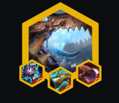
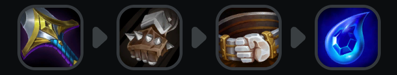
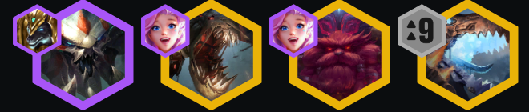

<!-- cover: dataTFT (7).png -->
<!-- backup: t-hex-pilot -->

# 海克斯霸龙

## 🎯 提示

把你棋盘价值最低的单位放在驾驶员海克斯格(例如图中所示的阿兹尔的黄沙士兵或者奥莉安娜)。驾驶员的成长性已经不值得了

2**皮尔特沃夫**优先级: 电流过载 > 爆裂护盾 >> 电磁脉冲 > 超频电容器 > 90口径绳网   

4**皮尔特沃夫**优先级: 磁控线圈 > 巨大化射线 > 加速之门   

6**皮尔特沃夫**优先级: <u>采矿钻机</u> > 护甲消除器 > 升级！

## ⭐ 最终阵容
.png>)

## 📊 阶段二

理想开局是凯特琳2星 + 蔚/洛里斯。如果代价不大(比如有新纪元或者DD街区)可以D巴德。

## 📊 阶段三

围绕4**皮尔特沃夫**打，优先最强战力。

别追3星——我们在3星术师削弱后不再追凯特琳3星了。

## 📊 阶段四

理想情况下解锁海克斯霸龙，打6**皮尔特沃夫** + 枪手和神盾使。

<u>找采矿钻机来快速9级</u>。

如果没中钻机，只打6**皮尔特沃夫**直到你找到阿兹尔之类的高费卡。

第二个带装备的海克斯霸龙也是一个胜利条件。

## 🔄 神器

## 🎯 强化符文

## ⭐ 强化符文优先级
经济 > 战力 > 装备

## 🚀 前期构成

## 🎒 装备优先级

## 💪 灵活单位

来源: TFT Academy
