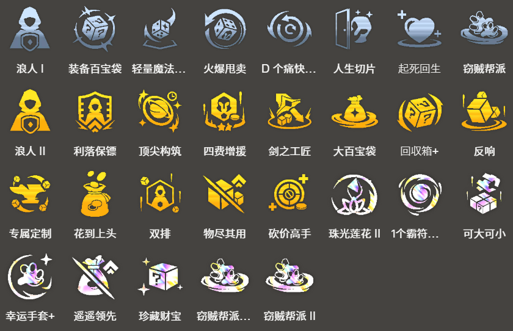

<!-- tags: 登顶阵容，运营95 -->
<!-- cover: dataTFT (30).png -->
<!-- backup: tahm-bilgewater-comp -->

# 比尔吉沃特塔姆阵容

## 🎯 阵容概述

这是一套围绕**比尔吉沃特**体系进行过渡的强力阵容。**塔姆**的技能配合**河流之王**和比尔吉沃特特性带来的成长能力贼强，而且能塞进去的5费英雄特别多，拿1很轻松。

最终成型棋盘固定使用：塔姆、**厄运小姐**、**卢锡安与赛娜**，再加上1个比尔吉沃特单位。剩下的位置就看你抽到什么俩星5费，直接上就完事了。

## 🚀 前置条件

阶段1拿到**崔斯特**（也就是说2-1能开出**比尔吉沃特**）。

按照**比尔吉沃特**的机制，越早上场越好，能更快积攒『银蛇币』。

## 🤩 最终阵容
.png>)

## 💰 银蛇币使用策略

<u>前期优先买普朗克和诺提勒斯</u>，这样能更快开出**5比尔吉沃特**。买重复单位来升星也挺不错的。

幸运达布隆金币现在被削了，不用买。

打赢架很重要，能多攒银蛇币，所以<u>8级时疯狂D牌把厄运小姐拉到2星</u>。

**7比尔吉沃特**的装备里，酒吧指虎和成堆柑橘这种坦克装超猛。要是看到2个想要的装备，直接把比尔吉沃特降到5甚至更低都行。

从商店买东西的时候，要根据实际需求灵活调整**比尔吉沃特**的数量。

装备买完了就去买属性加成。

## 💡 运营小技巧

**河流之王**前排扛不住的时候就加生命值，有余力的时候加法术加成，让塔姆的技能能秒人。

基本上要吃利息，喂便宜单位就行。等阵容成型了再喂贵的。

喂俩星单位效率更高，所以**俄洛伊**、**格雷福斯**、**崔斯特**、**普朗克**这些不要的单位，有钱就直接喂掉。

## 🎒 装备优先级

**卢锡安与赛娜**

**厄运小姐**

**塔姆**

过渡期间把卢锡安的装备先给厄运小姐、普朗克或者格雷福斯用着。

最后多余的**比尔吉沃特**武器都给厄运小姐。

## 🔓 英雄解锁

**格雷福斯**

战斗配置条件：给**崔斯特**装备2件装备

要是决心玩这套，1-4就给崔斯特装2件装备，最速开出**3比尔吉沃特**。

2-1看完强化符文再决定也来得及

**菲兹**

7级以上 + 战斗配置：5种不同的"约德尔人"或"比尔吉沃特"单位

**塔姆**

**比尔吉沃特**的银蛇币消耗达到500

银蛇币到500的话，稍微买点不太需要的东西解锁也行。用完500银蛇币后直接刷新，不用战斗塔姆就会出现在商店里，能最快上场。

**沃利贝尔**

8级以上 + 战斗配置：生命值达到3800开始战斗的单位

用塔姆的**河流之王**堆血，或者在**比尔吉沃特**商店买最大生命值+4%，很容易解锁。

## 🎯 强化符文

来源:tftips