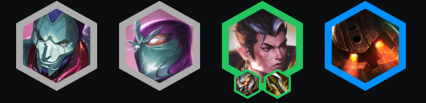
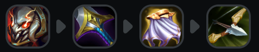
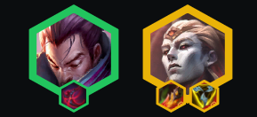
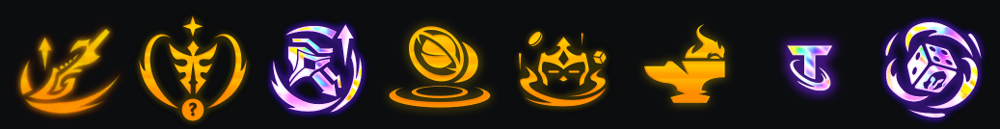
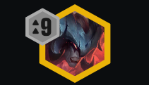

<!-- cover: dataTFT (15).png -->
<!-- backup: trials-twilight-zaahen -->

# 暮光试炼 艾欧尼亚

## 🎯 提示

理想情况下搭配强化符文：繁荣 = 启迪 = 灵魂 >> 其他选择。

在高资源局中，你需要为**亚索**、**永恩**和**亚恒**准备装备。

如果无法找出3星**亚索**，可以转为给**芸阿娜**做装备。

## 🚀 前期构成

## 🎒 装备优先级

## ⭐ 最终阵容

.png>)

## 📊 二阶段

用**赵信**和升级的**艾欧尼亚**单位打连胜。

如果有升级单位，也可以打**德玛西亚**开局。

## 📊 三阶段

升到6级并滚出2星**赵信**，搭配**艾欧尼亚**和**德玛西亚**。

在6级<u>慢D赵信和亚索</u>。

装备优先级：**赵信**装备 > 坦克装备 > **亚索**装备。

## 📊 四阶段

理想情况下在4-2前完成3星**赵信**，这样你就能在5阶段获得**亚恒**。

提升等级以获得更多**艾欧尼亚**单位。

用更多5费单位或2星**瑟提**来封顶阵容。

## 🔄 神器

## 🎯 强化符文

## ⭐ 强化符文优先级
装备 > 经济 > 战力

## 💪 阵容上限

来源: TFT Academy
