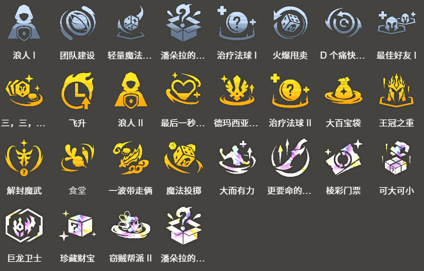

<!-- tags: 3费赌狗, 德玛西亚-->
<!-- cover: dataTFT (37).png -->
<!-- backup: vayne-loris-demacia-comp -->

# 薇恩 洛里斯

## 🎯 阵容概述

这是一套3费赌狗流阵容。<u>在7级时快速D牌</u>,凑齐**薇恩**和**洛里斯**。

前排超硬,通过**德玛西亚**的奋起效果加上**薇恩**的鬼索的狂暴之刃和海妖之怒,让这套阵容在长期战中贼强。

## 🚀 前置条件

阶段2抽到**薇恩**的时候。

过渡时拿到鬼索的狂暴之刃和海妖之怒的时候。

## 😶‍🌫️ 最终阵容
.png>)

## 💡 运营小技巧

**洛里斯**凑不齐三星的时候,可以把坦克装给**盖伦**,然后用**斯维因**和**卡莎**替换**洛里斯**和**凯特琳**。

**加里奥**不用上场也能让**德玛西亚**羁绊+1。有德玛西亚纹章的话,给**凯特琳**这种俩星单位,能更容易满足加里奥的解锁条件。

## 🎒 装备配置

**薇恩**

**洛里斯**

**拉克丝**

**盖伦**

## 🔓 英雄解锁

**波比**
战斗配置: 装备2件装备的「德玛西亚」或「约德尔人」

**加里奥**
战斗配置: 「德玛西亚」的星级合计达到12

**卡莎**
8级以上+战斗配置: 装备3件装备的「狙神」单位

## 🎯 强化符文

来源:tftips

【阵容码】#薇恩#MjE5OTgwMDYyNjAzNDUwODQxNzY2MDY3Mjg4NTk3