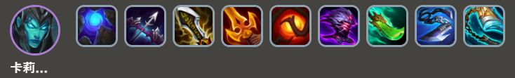
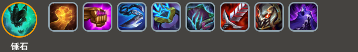
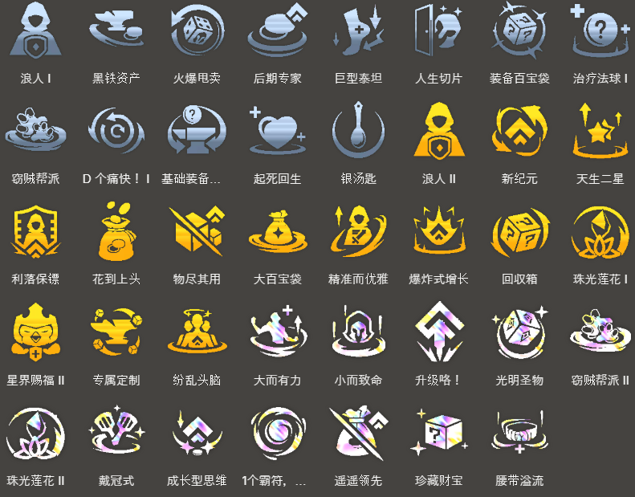

<!-- tags: 前四吃分 -->
<!-- cover: dataTFT (3).png -->
<!-- backup: viego-kalista-comp -->

#  卡莉丝塔 锤石

## 📋 概要

这是一套适合在前期拿到2星佛耶戈时转型的阵容。

利用佛耶戈前期的强大实力，从开始就能打出连胜展开。

## 🎯 前置条件

- 2-1前拿到2星佛耶戈时
- 抽到洛里斯、德莱文等与**暗影岛**羁绊相性好的单位时

佛耶戈只需要装备1件装备就能解锁约里克，

所以如果阵容方向还没定下来，建议在第1阶段就先解锁约里克，这样能增加阵容的选择余地。

## 😶‍🌫️ 前期过渡

## ⭐ 最终阵容
.png>)

## 🎒 装备

**卡莉丝塔**

**锤石**

优先制作卡莉丝塔的装备。

由于过渡期作为装备承载者的佛耶戈与推荐装备不同，可以考虑把装备先给厄斐琉斯、艾希、德莱文等英雄来推进度。

卡莉丝塔自带暴击判定的**征服者**羁绊，不过给她无尽之刃也完全OK。

这种情况下**征服者**羁绊的优先级会稍微降低。

<u>卡莉丝塔的技能循环非常重要</u>，所以装备里必须带上朔极之矛、蓝霸符或纳什之牙其中一件回蓝装备。

## 🔓 解锁

**约里克**

战斗中部署：装备1个装备的佛耶戈

**格温**

Lv5以上+战斗中部署：10灵魂

**卡莉丝塔**

Lv7以上+战斗中部署：30灵魂

<u>如果经济充裕，3-2或3-3升到Lv7快速解锁也没问题</u>。

大致标准是，升到Lv7后还能剩30金币就可以考虑升级。

**锤石**

Lv8以上+战斗中部署：合计星级达到5的"暗影岛"单位

## 🎯 强化符文

来源: tftips
