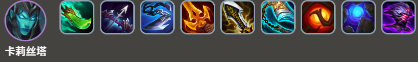
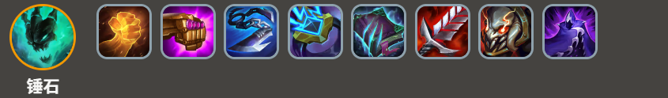
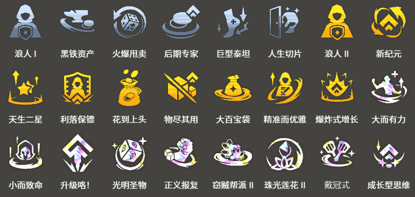

<!-- tags: 卡莉丝塔,暗影岛,9级运营 -->
<!-- cover: dataTFT (62).png -->
<!-- backup: viego-shadow-isles-comp -->
# 暗影岛 卡莉丝塔

## 📖 概要

这套阵容适合在最前期能做出**2星佛耶戈**时选择。利用佛耶戈前期的超强实力，目标是直奔9级。

基本思路是<u>在锤石解锁后升9级再快速D牌</u>，所以前期要尽可能追求连胜。过渡时最好能带上**比尔吉沃特**或者**德莱文**来增加黑市收益。

## 🎯 前置条件

**2-1回合前佛耶戈升到2星**

**暗影岛**羁绊中除了佛耶戈以外的单位全部锁定，如果**约里克**解锁稍有延迟，**锤石**的解锁也会跟着延后。必须确保2-1前佛耶戈已经升到2星。

## 😶‍🌫️ 最终阵容
.png>)

## 🎒 装备

**卡莉丝塔**

**锤石**

因为要给佛耶戈带装备推进度，建议优先做锤石用的战士系装备。像**饮血剑**、**泰坦的坚决**、**夜之锋刃**这种不是锤石理想装备的战士装，只要能帮你连胜，可以直接做上去。

卡莉丝塔的技能循环贼重要，装备里必须带一件回蓝装：**朔极之矛**、**蓝霸符**、**纳什之牙**或者**适应性头盔**，选一个就行。

## 🔓 解锁

**约里克**
- 战斗中配置：装备2件装备的2星佛耶戈
- 必须要2星佛耶戈才能解锁约里克

**格温**
- 收集20个暗影岛魂
- 预计2-6回合左右解锁

**卡莉丝塔**
- 收集70个暗影岛魂
- 预计3-5或3-6回合左右解锁

**锤石**
- 收集175个暗影岛魂
- 预计4-5或4-6回合左右解锁

## ⭐ 强化符文

来源：tftips
