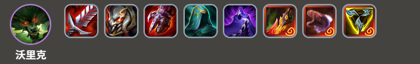
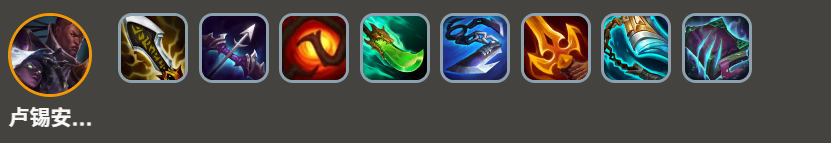
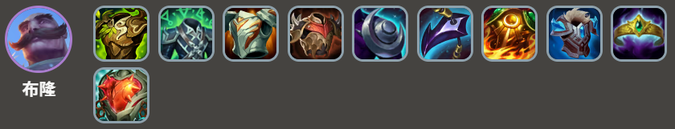
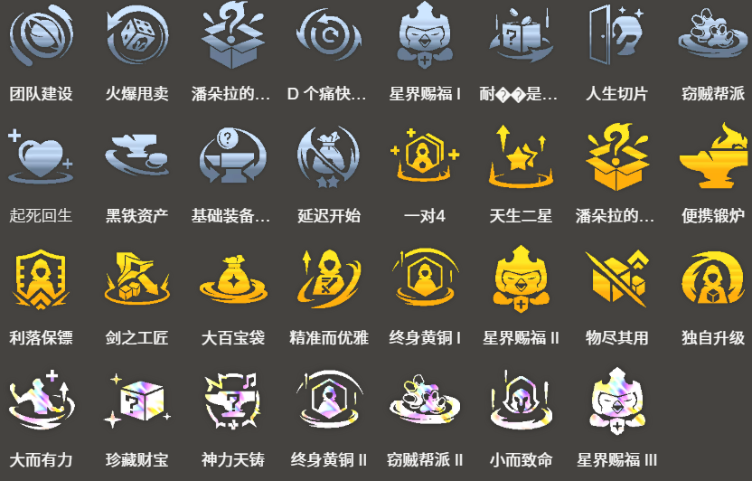

<!-- tags: 战士阵容,沃里克,4费核心 -->
<!-- cover: dataTFT (57).png -->
<!-- backup: warwick-vi-fighter-comp -->

# 布隆 沃里克

## 🎯 阵容概述

这是一套以战士装备为核心的4费阵容。用战士装备过渡时,可以顺势转型这套阵容。

阵容大部分单位都是3费及以下,所以稳定性还可以,但要拿第一很难。

<u>如果蔚没升到2星</u>,在8级快速D牌的收益不高。所以可以考虑在7级轻D一波,先把沃里克解锁再说。

**卢锡安与赛娜**来之前,先用厄运小姐或者千珏顶替。9级的空位也同样用千珏。

## 😶‍🌫️ 最终阵容
.png>)

## 🎮 前置条件

- 过渡时做出了**嗜血剑**/**泰坦的坚决**/**斯特拉克的挑战护手**等战士装备
- 拿到了**连指手套**/**死亡之蔑**/**三相之力**等跟沃里克超配的神器
- 早期就抽到了蔚

蔚在其他阵容里也是热门单位,经常会出现抢不到的情况。

建议在<u>早期蔚已经升星(或者有升星苗头)的时候</u>再考虑往这套转。

## 🎒 装备推荐

### 沃里克

优先给**沃里克**做战士装备。

理想状态是把**嗜血剑**/**泰坦的坚决**/**斯特拉克的挑战护手**三件套凑齐。<u>控制免疫特别关键</u>,所以**泰坦的坚决**或**水银**必须二选一带上。

### 卢锡安与赛娜

### 布隆

这套阵容**无用大棒**会严重过剩,可以考虑把红霸符换成莫雷洛秘典,或者做个冕卫来消耗散件。

## 🔓 解锁条件

**沃里克**解锁需要:
- 7级以上
- 战斗中同时部署: **1星金克丝** + **2星蔚**

## 💎 强化符文推荐

**注意:** 如果拿了**一对4**,记得不要放厄运小姐,会冲突。

蔚2星是这套的必需品,而且在过渡期也是最强单位之一,所以<u>能帮助早期蔚升星的强化符文</u>价值都挺高。

**来源**: tftips

【阵容码】#沃里克#MjE5OTgwMDYyNjAzNDUwODQxNzY2NzcyNzE0Njc2