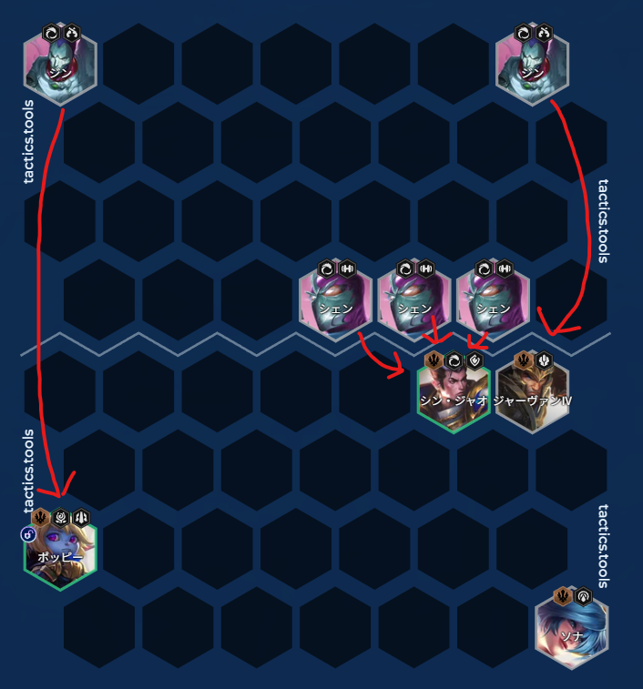
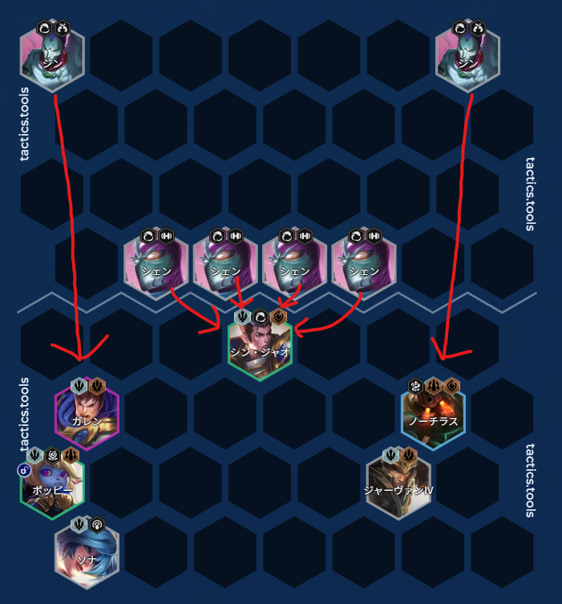

<!-- backup: xin-zhao-trials-of-twilight -->

# 赵信暮光试炼   站位优化指南

## 🎯 攻略概述

选择赵信的强化符文**"暮光试炼"**后，通过优化站位可以显著提升对局胜率。

## 💡 核心原理

**赵信技能特性**
- 范围伤害(AoE)，攻击目标增加时伤害不衰减
- **理想状态**：让敌方单位包围赵信
- **伤害倍增**：被3个单位包围时，伤害输出达到3倍

## 📍 站位策略

### 策略1 - 应对偏侧站位（前期常见）

**适用场景**：敌方阵容集中在地图一侧

**站位效果**：
- 敌方坦克攻击赵信
- 敌方输出攻击我方坦克（嘉文四世/波比）
- 赵信受保护的同时对3个坦克高效输出
- 若遇到对侧敌人，波比会吸引敌方输出火力

### 策略2 - 应对中央站位（中期常见）

**适用场景**：敌方前排集中在中央

**站位效果**：
- 赵信同时攻击4个单位
- 敌方输出攻击我方坦克（盖伦/诺提勒斯）
- 赵信在坦克倒下前几乎完全安全地输出

## ⚠️ 不适用场景

**战士阵容**
- 前提条件：敌方输出为远程且会被我方坦克吸引
- 风险：面对艾克等高单体伤害近战时，赵信可能被秒杀
- 建议：对阵奇亚娜/普朗克可尝试，但需评估自身阵容强度和装备

**缺乏吸血手段**
- 问题：赵信持续承受敌方攻击
- 风险：无全能吸血时，可能在输出前被击杀
- 建议：确保赵信有回复装备

## 📝 总结

利用赵信"攻击目标增加不衰减"的特性，通过精准站位最大化范围伤害。对局细节决定生命值保存和连胜维持，获得暮光试炼强化符文时必须掌握的技巧。

**来源：** Reddit翻译整理
