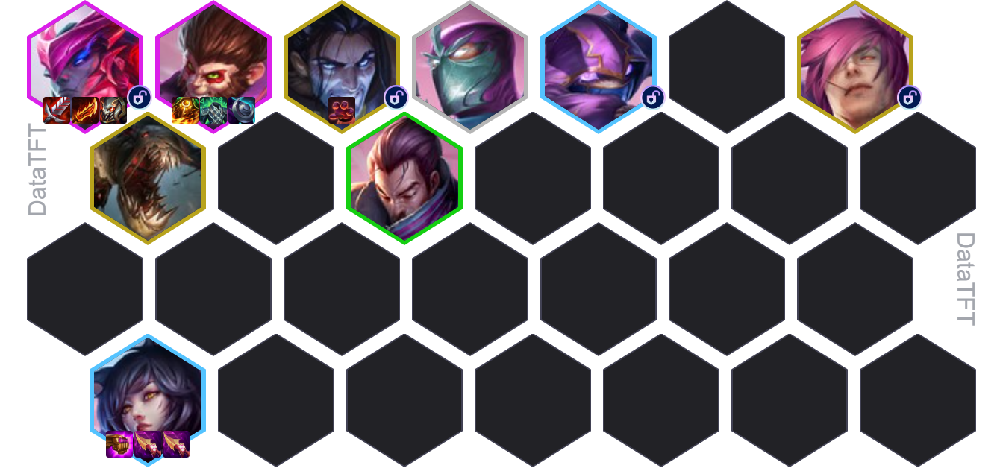
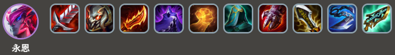
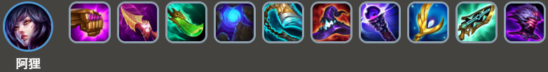
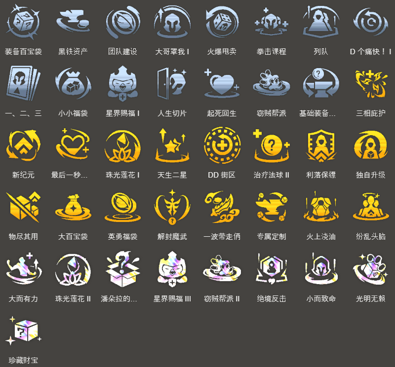

<!-- tags: 稳定吃分 -->
<!-- cover: dataTFT (1).png -->
<!-- backup: yone-ahri-comp-guide -->

# 永恩 阿狸

## 📖 概要

16.6补丁大幅降低了**永恩**的解锁条件，这套阵容就是围绕他打造的。

副C阿狸是3费英雄，可以在7级轻D牌来稳定成型。稳定性强是这套阵容的核心优势。

<u>在解锁塞拉斯之前</u>，可以用同羁绊的妮蔻过渡。

到9级后，加入费德提克、希瓦娜、卢锡安与赛娜等单卡强力的5费英雄。

## 🎯 前置条件

- 艾欧尼亚单位来得多
- 开局阿狸掉落
- 有艾欧尼亚相关强化符文

## ⭐ 最终阵容

## 🔄 快速D牌思路

这套阵容必须把2费的**亚索**升到2星，如果亚索数量不够就直接冲8级，很可能导致永恩解锁失败。

推荐的打法是在7级D牌，目标是2星亚索+2星阿狸，拿连胜顺势上8级。

如果阿狸来得特别多，可以在8级追永恩2星的同时冲阿狸3星，强度贼高。

## 🎒 装备优先级

### 永恩

### 猴子

### 阿狸

**装备制作思路**: 永恩和阿狸的装备都得准备。过渡时谁更强就先给谁做装备。

如果已经拿到阿狸，优先做法师装；

如果用亚索或奇亚娜过渡，就先做战士装。

阿狸每3次施法就能打出强化技能，所以朔极之矛、纳什之牙、蓝霸符、适应性头盔这类回蓝装备优先做。

## 🔓 解锁英雄

### 凯南

**解锁条件**: 5级以上+战斗中配置：艾欧尼亚、约德尔人、护卫 星级总和达到5

配合妮蔻和阿狸可以打出强力的前期进攻，建议尽早解锁。

### 永恩

**解锁条件**: 7级以上+战斗中配置：2星亚索装备3件装备

### 塞拉斯

**解锁条件**: 9级以上+卖出1个2星盖伦

这是9级最大的战力提升点。从7级、8级开始就要留着盖伦边D牌。

## ⭐ 强化符文优先级

来源: tftips
